# aws_certified_developer_associate

## Introdução
O exame AWS Certified Developer – Associate (DVA-C01) destina-se a pessoas que desempenham a
função de desenvolvedor. O exame valida a capacidade de um candidato de:
Demonstrar um entendimento dos principais produtos e usos da AWS, bem como as práticas
recomendadas básicas de arquitetura da AWS
Demonstrar proficiência em desenvolvimento, implantação e depuração de aplicações baseadas
na nuvem usando a AWS

## Descrição do candidato
O candidato deve ter um ano ou mais de experiência prática no desenvolvimento e na manutenção de uma aplicação baseada na AWS.

# Conhecimento geral de TI recomendado
O candidato deve ter: 
1. Conhecimento aprofundado em pelo menos uma linguagem de programação de alto nível 
2. Compreensão do gerenciamento do ciclo de vida da aplicação 
3. Capacidade de escrever código para aplicações sem servidor 

4. Compreensão do uso de contêineres no processo de desenvolvimento 
   
# Conhecimento recomendado da AWS
O candidato deve ser capaz de:

1. Usar as APIs de produtos da AWS, a CLI e os kits de desenvolvimento de software (SDKs) para escrever aplicações
2. Identificar os principais recursos dos produtos da AWS
3. Compreender o modelo de responsabilidade compartilhada da AWS
4. Usar um pipeline de integração e entrega contínuas (CI/CD) para implantar aplicações na AWS
5. Usar e interagir com os produtos da AWS
6. Aplicar o entendimento básico de aplicações nativas da nuvem para escrever código
7. Escrever código usando as práticas recomendadas de segurança da AWS (por exemplo, usar funções do IAM em vez de chaves de acesso e chaves secretas no código)
8. Criar, manter e depurar módulos de código na AWS

## O que é considerado fora do escopo do candidato?
Veja a seguir uma lista (não completa) de tarefas de trabalho relacionadas as quais não se espera que o
candidato seja capaz de executar. Estes itens são considerados fora do escopo do exame 
 1. Projetar arquiteturas (por exemplo, sistema distribuído, microsserviços)
 2. Projetar e implementar pipelines de CI/CD
 3. Administrar usuários e grupos do IAM
 4. Administrar o Amazon Elastic Container Service (Amazon ECS)
 5. Projetar a infraestrutura de redes da AWS (por exemplo, Amazon VPC, AWS Direct Connect)
 6. Compreender a compatibilidade e o licenciamento

# Guia do Exame
## AWS Certified Developer – Associate (DVA-C01) Guia do exame 
https://d1.awsstatic.com/pt_BR/training-and-certification/docs-dev-associate/AWS-Certified-Developer-Associate_Exam-Guide.pdf 
Acessado em: 05/10/2021 as 12:10


## Descrição do conteúdo
Este guia de exame inclui os pesos, os domínios do teste e os objetivos do exame. 
Não é uma lista abrangente do conteúdo do exame. 
No entanto, disponibilizamos um contexto adicional para cada um dos objetivos visando ajudar a orientar sua preparação para o exame. 
A tabela a seguir lista os principais domínios de conteúdo e seus pesos. 
A tabela precede a descrição completa do conteúdo do exame, que inclui o contexto adicional. A porcentagem de cada domínio representa apenas o conteúdo pontuado.


| Domínio                                            |       % do exame    | 
| -------------------------------------------------- | ------------------- |
| Domínio 1: Implantação                             |         22%         |
| Domínio 2: Segurança                               |         26%         |
| Domínio 3: Desenvolvimento com os produtos da AWS  |         30%         |
| Domínio 4: Refatoração                             |         10%         |
| Domínio 5: Monitoramento e resolução de problemas  |         12%         |
| TOTAL                                              |        100%         |


## Domínio 1: Implantação
- 1.1 Implantar código escrito na AWS usando pipelines, processos e padrões de CI/CD existentes 
  -  1.1.1 Confirmar o código em um repositório e invocar ações de construção, teste e/ou implantação<
  -  1.1.2 Usar rótulos e ramificações para o gerenciamento de versões e releases 
  -  1.1.3 Usar o AWS CodePipeline para orquestrar fluxos de trabalho em diferentes ambientes
  -  1.1.4 Aplicar os serviços AWS CodeCommit, AWS CodeBuild, AWS CodePipeline, AWS CodeStar e AWS CodeDeploy para fins de CI/CD
  -  1.1.5 Executar um plano de reversão com base na política de implantação de aplicações

- 1.2 Implantar aplicações usando o AWS Elastic Beanstalk. 
  - 1.2.1 Utilizar ambientes compatíveis existentes para definir uma nova pilha de aplicações
  - 1.2.2 Empacotar a aplicação
  - 1.2.3 Apresentar uma nova versão da aplicação no ambiente do Elastic Beanstalk
  - 1.2.4 Utilizar uma política de implantação para uma versão da aplicação (ou seja, implantação “todas de uma vez”, contínua, contínua com lotes, imutável)
  - 1.2.5 Validar a integridade da aplicação usando o painel do Elastic Beanstalk
  - 1.2.6 Usar o Amazon CloudWatch Logs para instrumentar o registro em log de aplicações

- 1.3 Preparar o pacote de implantação de aplicações a ser implantado na AWS.
    - 1.3.1 Gerenciar as dependências do módulo de código (como variáveis de ambiente, arquivos de configuração e arquivos de imagem estática) dentro do pacote 
    - 1.3.2 Descrever a estrutura de diretórios de pacote/contêiner e organizar os arquivos   adequadamente
    - 1.3.3 Traduzir os requisitos de recursos de aplicação para os parâmetros de infraestrutura da AWS (por exemplo, memória, núcleos)

- 1.4 Implantar aplicações sem servidor
    - 1.4.1  Com base em um caso de uso, implementar e iniciar um modelo do AWS Serverless Application Model (AWS SAM)
    - 1.4.2 Gerenciar ambientes em produtos individuais da AWS (por exemplo, diferenciar entre desenvolvimento, teste e produção no Amazon API Gateway)

## Domínio 2: Segurança
- 2.1 Fazer chamadas autenticadas para produtos da AWS.  
  - 2.1.1 Comunicar a política necessária com base nos privilégios mínimos exigidos pela aplicação. 
  - 2.1.2 Assumir uma função do IAM para acessar um serviço
  - 2.1.3 Usar o provedor de credenciais do kit de desenvolvimento de software (SDK) on-premises ou na nuvem para acessar os produtos da AWS (credenciais locais versus funções de instância)

- 2.2 Implementar criptografia usando os produtos da AWS. 
  - 2.2.1 Criptografar dados em repouso (lado do cliente; lado do servidor; criptografia de envelope) usando produtos da AWS 
  - 2.2.2 Criptografar dados em trânsito 

- 2.3 Implementar a autenticação e a autorização de aplicações. 
  - 2.3.1 Adicionar a funcionalidade de cadastro e login de usuários para aplicações com grupos de usuários ou de identidades do Amazon Cognito 
  - 2.3.2 Usar as credenciais fornecidas pelo Amazon Cognito para escrever código capaz de acessar
    os produtos da AWS. 
  - 2.3.3 Usar a sincronização do Amazon Cognito para sincronizar dados e perfis de usuários 
  - 2.3.4 Usar identidades autenticadas pelo desenvolvedor para promover a interação entre os dispositivos de usuário final, a autenticação de backend e o Amazon Cognito 


## Domínio 3: Desenvolvimento com os produtos da AWS
- 3.1 Escrever código para aplicações sem servidor.
  - 3.1.1 Comparar e contrastar o modelo baseado em servidor com o modelo sem servidor (por
exemplo, microsserviços, a natureza sem estado de aplicações sem servidor, a escalabilidade de aplicações sem servidor e o desacoplamento de camadas de aplicações sem servidor) 
  - 3.1.2 Configurar as funções do AWS Lambda definindo variáveis e parâmetros de ambiente (por exemplo, memória, tempo de espera, tempo de execução, manipulador) 
  - 3.1.3 Criar um endpoint de API usando o Amazon API Gateway 
  - 3.1.4 Criar e testar ações de API apropriadas, como GET e POST usando o endpoint da API 
  - 3.1.5 Aplicar conceitos do Amazon DynamoDB (por exemplo, tabelas, itens e atributos) 
  - 3.1.6 Calcular unidades de capacidade de leitura/gravação para o Amazon DynamoDB com base nos requisitos da aplicação 
  - 3.1.7 Associar uma função do AWS Lambda a uma fonte de eventos da AWS (por exemplo, Amazon API Gateway, Amazon CloudWatch Events, eventos do Amazon S3, Amazon Kinesis) 
  - 3.1.8 Invocar uma função do AWS Lambda de forma síncrona e assíncrona 

- 3.2 Traduzir requisitos funcionais para o design de aplicações.
  - 3.2.1 Determinar se deve ser usado o processamento em tempo real ou o processamento em lote para um dado caso de uso 
  - 3.2.2 Determinar se a forma síncrona ou assíncrona é a mais adequada para um dado caso de uso 
  - 3.2.3 Determinar se o uso de evento ou da programação/sondagem é mais adequado para um dado caso de uso 
  - 3.2.4 Considerar as vantagens e as desvantagens dos modelos de consistência em um design de aplicação 

- 3.3 Implementar o design da aplicação em seu próprio código.
  - 3.3.1 Escrever código para utilizar serviços de sistema de mensagens (por exemplo, SQS, SNS) 
  - 3.3.2 Usar o Amazon ElastiCache para criar um cache de banco de dados 
  - 3.3.3 Usar o Amazon DynamoDB para indexar objetos no Amazon S3 
  - 3.3.4 Escrever uma função sem estado do AWS Lambda 
  - 3.3.5 Escrever uma aplicação Web com servidores Web sem estado (externalizar estado) 

- 3.4 Escrever código capaz de interagir com os produtos da AWS usando APIs, SDKs e a AWS CLI.
  - 3.4.1 Escolher as APIs, os kits de desenvolvimento de software (SDKs) e os comandos da CLI apropriados para os componentes de código 
  - 3.4.2 Escrever código resiliente capaz de lidar com falhas ou exceções (ou seja, novas tentativas com jitter e recuo exponencial) 


## Domínio 4: Refatoração
- 4.1 Otimizar a aplicação para usar melhor os recursos e produtos da AWS. 
  - 4.1.1 Implementar serviços de armazenamento em cache da AWS para otimizar a performance (por exemplo, Amazon ElastiCache, cache do Amazon API Gateway) 
  - 4.1.2 Aplicar um esquema de nomenclatura do Amazon S3 para uma performance de leitura ideal 

- 4.2 Migrar o código de aplicação existente para executar na AWS.
  - 4.2.1 Isolar dependências 
  - 4.2.2 Executar a aplicação como um ou mais processos sem estado 
  - 4.2.3 Desenvolver visando habilitar a escalabilidade horizontal 
  - 4.2.4 Externalizar o estado 


## Domínio 5: Monitoramento e resolução de problemas
- 5.1 Escrever código passível de monitoramento. 
  - 5.1.1 Criar métricas personalizadas do Amazon CloudWatch 
  - 5.1.2 Executar o registro em log de maneira disponível para os operadores de sistemas 
  - 5.1.3 Instrumentar o código-fonte da aplicação para habilitar o rastreamento no AWS X-Ray 

- 5.2 Executar análise de causa raiz em falhas encontradas em testes ou na produção. 
  - 5.2.1 Interpretar as saídas do mecanismo de registro na AWS para identificar erros em logs 
  - 5.2.2 Verificar o histórico de construção e testes nos produtos da AWS (por exemplo, AWS CodeBuild, AWS CodeDeploy, AWS CodePipeline) para identificar problemas 
  - 5.2.3 Utilizar os produtos da AWS (por exemplo, Amazon CloudWatch, VPC Flow Logs e AWS XRay) para localizar um componente defeituoso específico 

# Apêndice
Quais são as principais ferramentas, tecnologias e conceitos que podem ser abordados no exame?
Veja a seguir uma lista (não completa) de ferramentas e tecnologias que podem aparecer no exame.
Essa lista está sujeita a alterações e é fornecida para ajudar a entender o escopo geral de serviços,
recursos ou tecnologias no exame. As ferramentas e tecnologias gerais dessa lista não aparecem em
nenhuma ordem específica. Os produtos da AWS são agrupados de acordo com suas funções principais.
Embora algumas dessas tecnologias provavelmente sejam abordadas mais do que outras no exame, a
ordem e colocação delas na lista não são indicativos de importância nem de peso relativo:

-  Análise
-  Integração de aplicações
-  Contêineres
-  Gerenciamento de custos e capacidade
-  Movimentação de dados
-  Ferramentas do desenvolvedor
-  Instâncias (máquinas virtuais)
-  Gerenciamento e governança
-  Redes e entrega de conteúdo
-  Segurança
-  Ambientes sem servidor

# Recursos e produtos da AWS Análise:
-  Amazon Elasticsearch Service (Amazon ES)
-  Amazon Kinesis 

# Integração de aplicações:
-  Amazon EventBridge (Amazon CloudWatch Events)
-  Amazon Simple Notification Service (Amazon SNS)
-  Amazon Simple Queue Service (Amazon SQS)
-  AWS Step Functions

# Computação:
-  Amazon EC2
-  AWS Elastic Beanstalk
-  AWS Lambda

# Contêineres:
-  Amazon Elastic Container Registry (Amazon ECR)
-  Amazon Elastic Container Service (Amazon ECS)
-  Amazon Elastic Kubernetes Services (Amazon EKS)

# Banco de dados:
-  Amazon DynamoDB
-  Amazon ElastiCache
-  Amazon RDS

# Ferramentas do desenvolvedor:
- AWS CodeArtifact
    - Secure, scalable, and cost-effective artifact management for software development
    - AWS CodeArtifact is a fully managed artifact repository service that makes it easy for organizations of any size to securely store, publish, and share    software packages used in their software development process. 
    - CodeArtifact can be configured to automatically fetch software packages and dependencies from public artifact repositories so developers have access to the latest versions. 
    - CodeArtifact works with commonly used package managers and build tools like Maven, Gradle, npm, yarn, twine, pip, and NuGet making it easy to integrate into existing development workflows.
    - AWS CodeArtifact is a pay-as-you go artifact repository service that scales based on the needs of the organization. With CodeArtifact there is no software to update or servers to manage. 
    - IT leaders can also approve packages and control distribution across the organization, ensuring development teams consume software packages that are safe for use.
    - ### Benefits
       - Securely store and share artifacts
            - CodeArtifact integrates with AWS Key Management Service (KMS) to provide encrypted storage. 
            - CodeArtifact supports AWS IAM, so IT leaders can grant the appropriate level of access to different teams across their AWS accounts.
        - Reduce operational overhead
            - CodeArtifact is a fully managed service, eliminating the need to set up and operate the infrastructure required to manage artifact repositories. - - CodeArtifact is highly available and scales to meet the needs of organizations of all sizes.
        - Pay as you go
            - With CodeArtifact, there are no upfront fees or licensing costs for features that you don’t use. 
            - You pay only for the software packages stored, the number of requests made, and the data transferred out of an AWS Region.
    - ### Key Features
      - Consume packages from public artifact repositories
          - You can configure CodeArtifact to fetch software packages from public repositories such as the npm Registry, Maven Central, PyPI, and NuGet.org with just a few clicks. 
          - CodeArtifact automatically downloads and stores application dependencies from these repositories, so recent versions are always available to your developers and CI/CD systems.
      - Publish and Share packages
          - You can use your existing package managers such as npm, pip, yarn, twine, Maven, and NuGet to publish packages developed within your organization. - - Development teams can save time by retrieving packages published to and shared in a central organizational repository, rather than creating their own.
      - Approve packages for use and audit package usage
          - You can approve packages for use by building automated workflows using CodeArtifact APIs and AWS EventBridge. 
          - Integration with AWS CloudTrail gives leaders visibility into which packages are in use and where, making it easy to identify packages that need to  be updated or removed.

## AWS CodeBuild
- AWS CodeBuild
    - Build and test code with continuous scaling. Pay only for the build time you use.
    - AWS CodeBuild is a fully managed continuous integration service that compiles source code, runs tests, and produces software packages that are ready to    deploy. With CodeBuild, you don’t need to provision, manage, and scale your own build servers. 
    - CodeBuild scales continuously and processes multiple builds concurrently, so your builds are not left waiting in a queue. 
    - You can get started quickly by using prepackaged build environments, or you can create custom build environments that use your own build tools. 
    - With CodeBuild, you are charged by the minute for the compute resources you use.  
    - ### Benefits
        - Fully managed build service
            - AWS CodeBuild eliminates the need to set up, patch, update, and manage your own build servers and software. 
            - There is no software to install or manage.
        - Continuous scaling
            - AWS CodeBuild scales up and down automatically to meet your build volume. 
            - It immediately processes each build you submit and can run separate builds concurrently, which means your builds are not left waiting in a queue.
        - Pay as you go
            - With AWS CodeBuild, you are charged based on the number of minutes it takes to complete your build. 
            - This means you no longer have to worry about paying for idle build server capacity.
        - Extensible
            - You can bring your own build tools and programming runtimes to use with AWS CodeBuild by creating customized build environments in addition to the prepackaged build tools and runtimes supported by CodeBuild.
        - Enables continuous integration and delivery
            - AWS CodeBuild belongs to a family of AWS Code Services, which you can use to create complete, automated software release workflows for continuous integration and delivery (CI/CD). 
            - You can also integrate CodeBuild into your existing CI/CD workflow. For example, you can use CodeBuild as a worker node for your existing Jenkins server setup for distributed builds.
        - Secure
            - With AWS CodeBuild, your build artifacts are encrypted with customer-specific keys that are managed by the AWS Key Management Service (KMS).
            - CodeBuild is integrated with AWS Identity and Access Management (IAM), so you can assign user-specific permissions to your build projects.


##  AWS CodeCommit
- AWS CodeCommit
    - Securely host highly scalable private Git repositories. Collaborate on code. 
    - AWS CodeCommit is a secure, highly scalable, managed source control service that hosts private Git repositories. 
    - It makes it easy for teams to securely collaborate on code with contributions encrypted in transit and at rest. 
    - CodeCommit eliminates the need for you to manage your own source control system or worry about scaling its infrastructure. 
    - You can use CodeCommit to store anything from code to binaries. 
    - It supports the standard functionality of Git, so it works seamlessly with your existing Git-based tools.
    - ### Benefits
        - Fully managed
            - AWS CodeCommit eliminates the need to host, maintain, back up, and scale your own source control servers. 
            - The service automatically scales to meet the growing needs of your project.
        - Secure
            - AWS CodeCommit automatically encrypts your files in transit and at rest. 
            - CodeCommit is integrated with AWS Identity and Access Management (IAM) allowing you to customize user-specific access to your repositories.
        - High availability
            - AWS CodeCommit has a highly scalable, redundant, and durable architecture. 
            - The service is designed to keep your repositories highly available and accessible.
        - Collaborate on code
            - AWS CodeCommit helps you collaborate on code with teammates via pull requests, branching, and merging. 
            - You can implement workflows that include code reviews and feedback by default, and control who can make changes to specific branches.
        - Faster development lifecycle
            - AWS CodeCommit keeps your repositories close to your build, staging, and production environments in the AWS cloud. 
            - You can transfer incremental changes instead of the entire application. 
            - This allows you to increase the speed and frequency of your development lifecycle.
        - Use your existing tools
            - AWS CodeCommit supports all Git commands and works with your existing Git tools. 
            - You can keep using your preferred development environment plugins, continuous integration/continuous delivery systems, and graphical clients with CodeCommit.

    - ### Credentials
        - !Ref={https://docs.aws.amazon.com/IAM/latest/UserGuide/id_credentials_ssh-keys.html}
        - <b><i>Git credentials </b></i> - These are IAM -generated user name and password pair you can use to communicate with CodeCommit repositories over HTTPS.
        - <b><i>SSH Keys  </b></i>- Are locally generated public-private key pair that you can associate with your IAM user to communicate with CodeCommit repositories over SSH.
        - <b><i>AWS access keys </b></i> - You can use these keys with the credential helper included with the AWS CLI to communicate with CodeCommit repositories over HTTPS.


##  AWS CodeDeploy
- AWS CodeDeploy- 
- AWS CodeDeploy is a deployment service that automates application deployments to Amazon EC2 instances, on-premises instances, or serverless Lambda functions. 
- The blue/green deployment type uses the blue/green deployment model controlled by CodeDeploy. 
  - !Ref={https://aws.amazon.com/about-aws/whats-new/2017/01/aws-codedeploy-introduces-blue-green-deployments/}
- This deployment type enables you to verify a new deployment of service before sending production traffic to it.
- CodeDeploy offers lot of control over deployment steps. Please see this note for more details:
  - !Ref={https://docs.amazonaws.cn/en_us/codedeploy/latest/userguide/deployment-configurations.html}

## CodeBuild 
- CodeBuild - AWS CodeBuild is a fully managed continuous integration service that compiles source code, runs tests, and produces software packages that are ready to deploy. It cannot be used to deploy applications.

##  Amazon CodeGuru
- Amazon CodeGuru

##  AWS CodePipeline
- CodePipeline automates the build, test, and deploy phases of your release process every time there is a code change. CodePipeline by itself cannot deploy applications.
 

##  AWS CodeStar
- AWS CodeStar

##  AWS Fault Injection Simulator
- AWS Fault Injection Simulator

##  AWS X-Ray
- AWS X-Ray
  - Analyze and debug production, distributed applications
  - AWS X-Ray helps developers analyze and debug production, distributed applications, such as those built using a microservices architecture. 
  - With X-Ray, you can understand how your application and its underlying services are performing to identify and troubleshoot the root cause of performance issues and errors. 
  - X-Ray provides an end-to-end view of requests as they travel through your application, and shows a map of your application’s underlying components. 
  - You can use X-Ray to analyze both applications in development and in production, from simple three-tier applications to complex microservices applications consisting of thousands of services.
  - ### Benefits
    -!Ref={https://aws.amazon.com/xray/}
    - Review request behavior
        - AWS X-Ray traces user requests as they travel through your entire application. 
        - It aggregates the data generated by the individual services and resources that make up your application, providing you an end-to-end view of how your  application is performing.
    - Discover application issues
        - With AWS X-Ray, you can glean insights into how your application is performing and discover root causes. 
        - With X-Ray’s tracing features, you can follow request paths to pinpoint where in your application and what is causing performance issues. 
        - X-Ray provides annotations so you can append metadata to traces, making it possible to tag and filter trace data so you can discover patterns and diagnose issues.
    - Improve application performance
        - AWS X-Ray helps you identify performance bottlenecks. 
        - X-Ray’s service maps let you see relationships between services and resources in your application in real time. 
        - You can easily detect where high latencies are occurring, visualize node and edge latency distribution for services, and then drill down into the specific services and paths impacting application performance.
    - Ready to use with AWS
        - AWS X-Ray works with Amazon EC2, Amazon EC2 Container- Service (Amazon ECS), AWS Lambda, Amazon SQS, Amazon SNS and AWS Elastic Beanstalk. 
        - You can use X-Ray with applications written in Java, Node.js, and .NET that are deployed on these services.
    - Designed for a variety of applications
        - AWS X-Ray works for both simple and complex applications, either in development or in production. 
        - You can analyze simple asynchronous event calls, three-tier web applications, or complex microservices applications consisting of thousands of services. 
        - With X-Ray, you can trace requests made to applications that span multiple AWS accounts, AWS Regions, and Availability Zones.
    ### Learning
    - You can use X-Ray to collect data across AWS Accounts. 
    - The X-Ray agent can assume a role to publish data into an account different from the one in which it is running. 
    - This enables you to publish data from various components of your application into a central account.
    !Ref={https://docs.aws.amazon.com/xray/latest/devguide/aws-xray.html}


# Gerenciamento e governança:
-  AWS CloudFormation
-  Amazon CloudWatch

# Redes e entrega de conteúdo:
-  Amazon API Gateway
-  Amazon CloudFront
-  Elastic Load Balancing

# Segurança, identidade e compatibilidade:
-  Amazon Cognito
-  AWS Identity and Access Management (IAM)
-  AWS Key Management Service (AWS KMS)

# Storage:
## STORAGE CONCEPTS
Hard Disk Drives (HDD) have been around for a long while and are still in widespread use today. An
HDD is a mechanical drive with spinning platters and a head that floats above the platters and moves
into position to read and write data.

HDDs are also known as magnetic drives as they use magnetic polarization to record a one or zero value.
The performance of an HDD depends on a number of factors and these include the following
measurements:

  - Revolutions Per Minute (RPM) – the speed of rotation of the platters
  - Seek time – the mean time it takes to move the head of a disk drive from one track to another
  - Input / Output Operations Per Second (IOPS) – the number of IO transactions per second
  - Throughput – the data transfer rate of a drive

HDDs provide good throughput, large capacity, and are extremely low cost.

Solid State Drives (SSD) store data on non-volatile microchips and have no moving parts. Non-volatile
SSD chips differ from computer memory in that the data is retained when power is removed.

SSDs offer extremely high IOPS performance when compared to HDDs and also provide good
throughput. SSDs are also much more expensive.

## MEASURING DATA
Stored data is typically measured using the decimal system in: 
  - kilobytes (kB) 
  - Megabytes (MB)
  - Gigabytes (GB) 
  - Terabytes (TB)
  - Petabytes (PB)

In some cases, the binary prefix is used such as gibibyte (GiB). A gibibyte is equal to 1024 mebibytes
(MiB) while a gigabyte (GB) is equal to 1000 megabytes (MB).

To confuse matters, a GB of computer memory is equal to 1024 MB (rather than 1000 MB) and some
storage manufacturers have been known to use this measurement for disks too.

The following table shows how each term relates to the other in both the decimal and binary formats
and the values are the number of bytes (a byte is 8 bits).

## DATA ACCESSIBILITY SLAS
Cloud service providers will often provide service level agreements (SLAs) for the availability and
durability of their storage systems.

<b>Availability</b> relates to system uptime, i.e. the amount of time per month or year that the storage
system is operational and can deliver data upon request. Service providers aim to increase availability
by designing highly available and fault tolerant storage systems.

Availability is usually expressed as a percentage of uptime in a given year. The following table shows
some common availability SLAs and how much downtime each corresponds with:

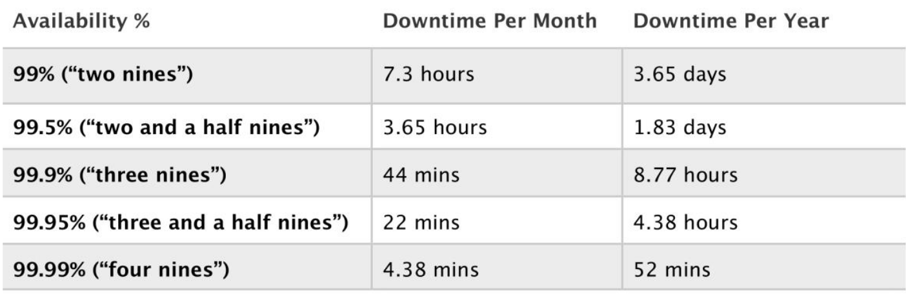</img>

Durability relates to measuring the amount of data that may be lost due to errors occurring when
writing data. In other words, durability measures the likelihood of losing some of your data.
Durability is usually expressed as a percentage of reliability and can also be interpreted as the number
of files that are likely to be lost in a given year.
The following table shows the four Amazon Simple Storage Service (S3) storage classes with their
respective durability SLAs and how many files could be lost per year:

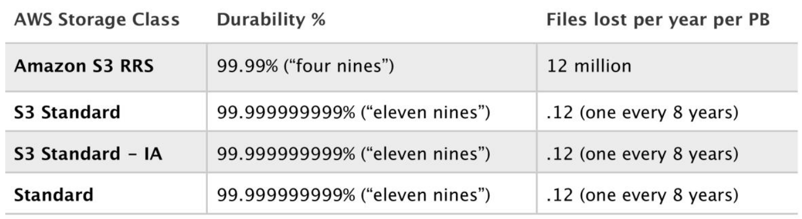</img>


## CLOUD STORAGE TYPES
As mentioned earlier, cloud storage is generally object-based, block-based or file-based storage. These
terms relate to the type of data stored, the protocols used to access it and the method of data storage.

### Object Storage
With object storage data is managed as individual objects rather than a file hierarchy (as with a
traditional file system). Each object includes the data itself, metadata (data about the data), and a
globally unique identifier.
Due to its flat file structure, object storage has virtually unlimited scalability and allows the retention
of massive amounts of unstructured data. The data is often replicated across multiple physical systems
and facilities providing high availability and durability.

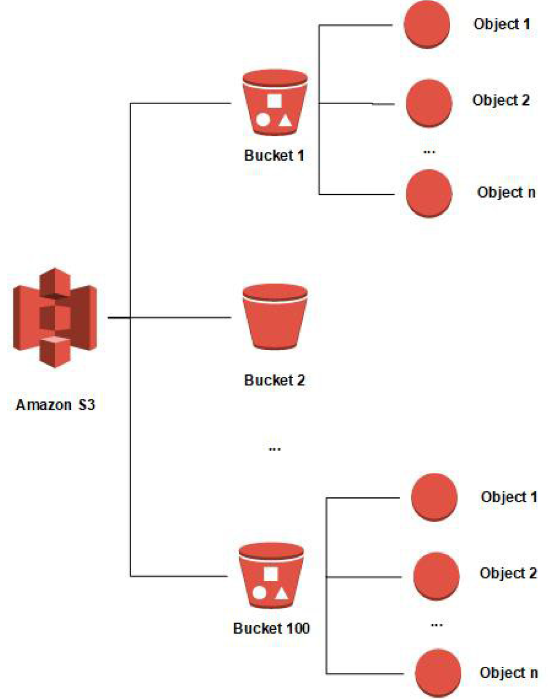</img>


Object storage is usually accessed over Representational State Transfer (REST) and Simple Object
Access Protocol (SOAP) over Hypertext Transfer Protocol (HTTP).


The Amazon Simple Storage Service (S3) is a key, value object-based storage system built to store and
retrieve huge amounts of data from any source.

Objects in S3 are stored in a flat structure with no hierarchy. The top level containers within which
objects are stored are known as buckets. Though there is no hierarchy, S3 does support the concept
of folders for organization (grouping of objects).

There are several S3 storage classes with varying levels of availability, durability and features. The
standard class offers the following features:

- Low latency and high throughput performance
- Designed for durability of 99.999999999% of objects across multiple Availability Zones
- Data is resilient in the event of one entire Availability Zone destruction
- Designed for 99.99% availability over a given year
- Backed with the Amazon S3 Service Level Agreement for availability
- Supports SSL for data in transit and encryption of data at rest
- Lifecycle management for automatic migration of objects

Common use cases for object storage include backup, application hosting, media hosting and software
delivery.


## Block Storage
Data is stored and managed in blocks within sectors and tracks and is controlled by a server-based
operating system. Block storage volumes appear as local disks to the operating system and can be
partitioned and formatted.

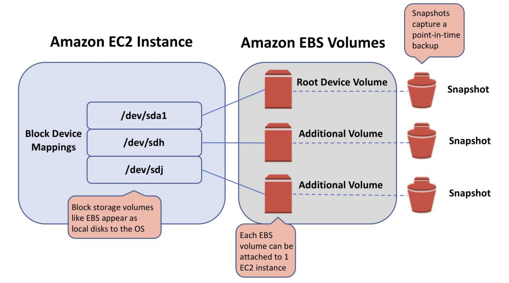</img>


Block storage is typically used in Storage Area Network (SAN) environments that use the Fibre Channel
(FC) protocol as well as Ethernet networks using protocols such as iSCSI or Fibre Channel over Ethernet
(FCoE).

Block storage is typically more expensive than object or file storage but provides low latency, and high
and consistent performance. The costs are often highest in SAN implementations due to the
specialized equipment required.

Amazon Elastic Block Store (EBS) is the AWS service for block storage. EBS provides persistent block
storage volumes for use with EC2 instances in the AWS cloud.
There are several EBS volume types to choose from with varying characteristics as can be seen in the
table below:

</img>

## Solid state drives (SSD-backed) volumes

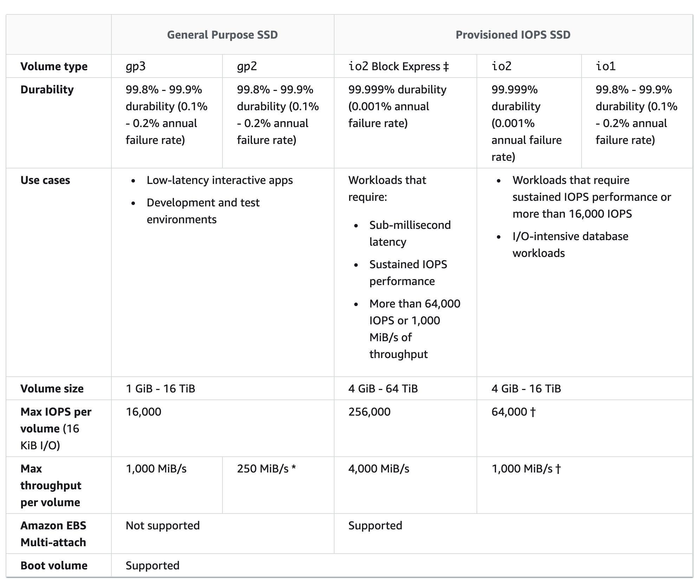</img>

### General Purpose SSD Volumes (gp2/gp3)
- General Purpose SSD volumes offer cost-effective storage that is ideal for a broad range of workloads.
- General Purpose SSD volumes deliver single-digit millisecond latencies
- General Purpose SSD volumes can range in size from 1 GiB to 16 TiB.
- General Purpose SSD (gp2) volumes
  - has a maximum throughput of 160 MiB/s (at 214 GiB and larger).
  - provides a baseline performance of 3 IOPS/GiB
  - provides the ability to burst to 3,000 IOPS for extended periods of time for volume size less then 1 TiB and up to a maximum of 16,000 IOPS (at 5,334 GiB).
  - If the volume performance is frequently limited to the baseline level (due to an empty I/O credit balance),
    - consider using a larger General Purpose SSD volume (with a higher baseline performance level) or
    - switching to a Provisioned IOPS SSD volume for workloads that require sustained IOPS performance greater than 16,000 IOPS.
- General Purpose SSD (gp3) volumes
  - deliver a consistent baseline rate of 3,000 IOPS and 125 MiB/s, included with the price of storage.
  - additional IOPS (up to 16,000) and throughput (up to 1,000 MiB/s) can be provisioned for an additional cost.
  - the maximum ratio of provisioned IOPS to provisioned volume size is 500 IOPS per GiB
  - the maximum ratio of provisioned throughput to provisioned IOPS is .25 MiB/s per IOPS.

## I/O Credits and Burst Performance
- I/O credits represent the available bandwidth that the General Purpose SSD volume can use to burst large amounts of I/O when more than the baseline performance is needed.
- General Purpose SSD (gp2) volume performance is governed by volume size, which dictates the baseline performance level of the volume for e.g. 100 GiB volume has a 300 IOPS @ 3 IOPS/GiB
- General Purpose SSD volume size also determines how quickly it accumulates I/O credits for e.g. 100 GiB with a performance of 300 IOPS can accumulate 180K IOPS/10 mins (300 * 60 * 10).
- Larger volumes have higher baseline performance levels and accumulate I/O credits faster for e.g. 1 TiB has a baseline performance of 3000 IOPS
- More credits the volume has for I/O, the more time it can burst beyond its baseline performance level and the better it performs when more performance is needed for e.g. 300 GiB volume with 180K I/O credit can burst @ 3000 IOPS for 1 minute (180K/3000)
- Each volume receives an initial I/O credit balance of 5,400,000 I/O credits, which is enough to sustain the maximum burst performance of 3,000 IOPS for 30 minutes.
- Initial credit balance is designed to provide a fast initial boot cycle for boot volumes and a good bootstrapping experience for other applications.
- Each volume can accumulate I/O credits over a period of time which can be to burst to the required performance level, up to a max of 3,000 IOPS
- Unused I/O credit cannot go beyond 54,00,000 I/O credits.

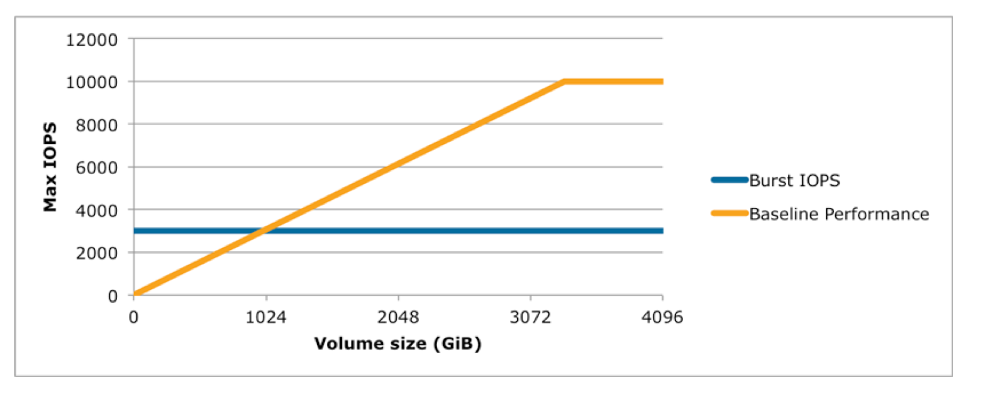</img>

- Volumes till 1 TiB can burst up to 3000 IOPS over an above its baseline performance
- Volumes larger than 1 TiB have a baseline performance that is already equal or greater than the maximum burst performance, and  their I/O credit balance never depletes.
- Baseline performance cannot be beyond 10000 IOPS for General Purpose SSD volumes and this limit is reached @ 3333 GiB

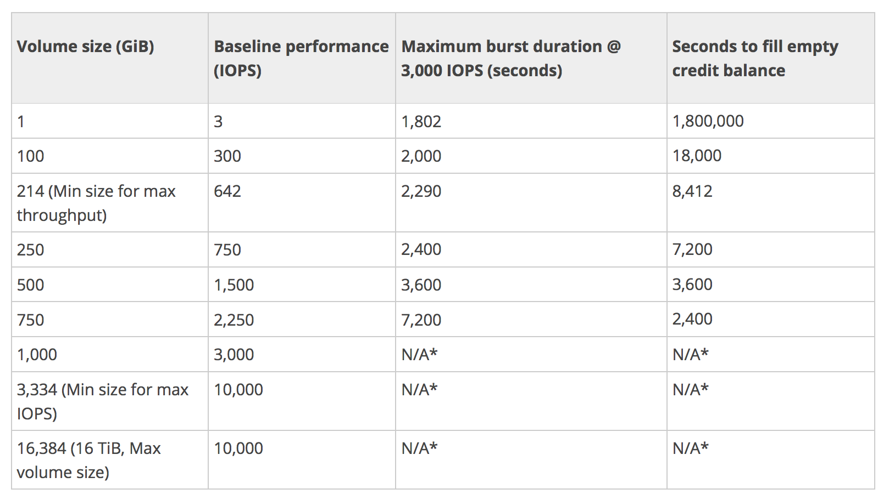</img>


- Baseline Performance
  - Formula – 3 IOPS i.e. GiB * 3
  - Calculation example
    - 1 GiB volume size =  3 IOPS (1 * 3 IOPS)
    - 250 GiB volume size = 750 IOPS (250* 3 IOPS)

Maximum burst duration @ 3000 IOPS


## Hard disk drives (HDD-backed) volumes
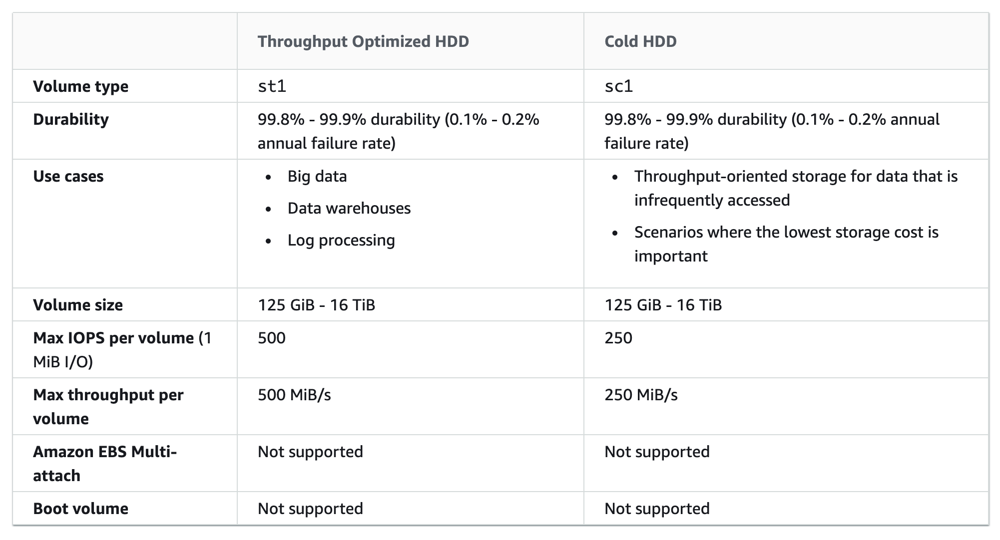</img>


## EBS Volume Types (Previous Generation – Reference Only)

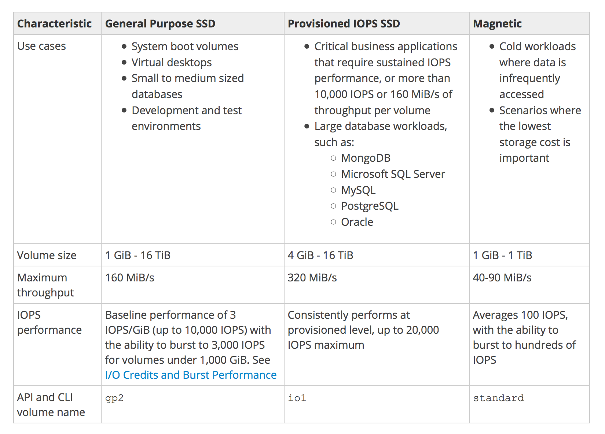</img>


# File Storage
File storage servers store data in a hierarchical structure using files and folders. Data is accessed as
file IDs across a network using either the Server Message Block (SMB) for Windows, or Network File
System (NFS) for Unix/Linux.

A file system is mounted via the network to a client computer where it then becomes accessible for
reading and writing data. Files and folders can be created, updated, and deleted.

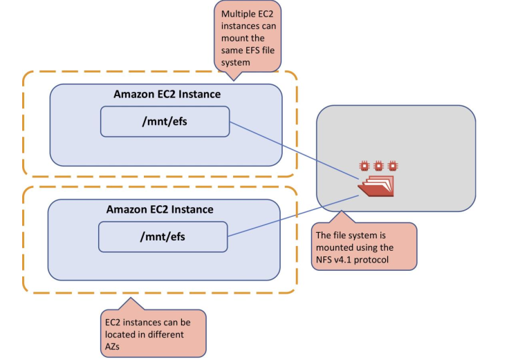</img>

Only file-level operations can occur on a mounted file system. It is not possible to issue block level
commands or format or partition the underlying storage volumes.

File storage is easy to implement and use and is generally quite inexpensive. Use cases include web
serving and content management, shared corporate directories, home drives, database backups and
big data analytics workloads.

The Amazon Elastic File System (EFS) is a simple, scalable, elastic file storage in the AWS cloud that is
based on NFS. EFS provides the ability to mount a file system to many EC2 instances simultaneously
and can achieve high levels of aggregate throughput and IOPS.

EFS is a regional AWS service and provides high availability and durability by storing data redundantly
across Availability Zones (AZs).


# Recursos e produtos da AWS fora do escopo
Veja a seguir uma lista (não completa) de recursos e produtos da AWS que não são abordados no
exame. Estes recursos e produtos não representam todos os serviços da AWS que foram excluídos do
conteúdo do exame. Os recursos ou produtos que não têm nenhuma relação com as funções de trabalho
às quais o exame se destina não estão nessa lista porque são considerados irrelevantes.
Os recursos e produtos da AWS fora do escopo são:
-  AWS Application Discovery Service
-  Amazon AppStream 2.0
-  Amazon Chime
-  Amazon Connect
-  AWS Database Migration Service (AWS DMS)
-  AWS Device Farm
-  Amazon Elastic Transcoder
-  Amazon GameLift
-  Amazon Lex
-  Amazon Machine Learning (Amazon ML)
-  AWS Managed Services
-  Amazon Mobile Analytics
-  Amazon Polly
-  Amazon QuickSight
-  Amazon Rekognition
-  AWS Server Migration Service (AWS SMS)
-  AWS Service Catalog
-  AWS Shield Advanced
-  AWS Shield Standard
-  AWS Snow Family
-  AWS Storage Gateway
-  AWS WAF
-  Amazon WorkMail
-  Amazon WorkSpaces  
  ## Trusted Advisor
  - Faz recomendações que ajudam você a seguir as melhores práticas da AWS.
  - Avalia a sua conta através de verificações.
    - Identificam formas de otimizar sua infraestrutura da AWS, aumentar a segurança e o desempenho, 
    - Reduzir os custos gerais e monitorar as cotas do serviço. 
    - Você pode seguir as recomendações da verificação para otimizar seus recursos e serviços.
  - Nivel de Suport 
    - AWS Developer Support 
      - Podem acessar as principais verificações de segurança e todas verificações de cotas de serviço. 
    - AWS Business Support e AWS Enterprise Support 
      - Podem acessar todas as verificações, incluindo;
         - ### Otimizações de custo:
            - Otimização de instâncias reservadas do Amazon EC2
            - Low Utilization Amazon EC2 Instances
            - Load balancers ociosos
            - Volumes Amazon EBS subutilizados
            - Endereços IP elásticos desassociados
            - Instâncias de banco de dados ociosas do Amazon RDS
            - Conjuntos de registros de recursos de latência do Amazon Route 53
            - Amazon EC2 Reserved Instance Lease Expiration
            - Underutilized Amazon Redshift Clusters
            - Savings Plan
            - Otimização de nós reservados do Amazon ElastiCache
            - Otimização de nós reservados do Amazon Redshift
            - Otimização de instâncias reservadas do Amazon Relational Database Service (RDS)
            - Otimização de instâncias reservadas do Amazon Elasticsearch
            - Funções do AWS Lambda com altas taxas de erro
            - Funções AWS Lambda com limites de tempo excessivos
            
         - ### Segurança: 
            - Grupos de segurança - Portas específicas sem restrições (gratuito)
            - Grupos de segurança - Acesso irrestrito
            - Uso do AWS IAM (gratuito)
            - Permissões de bucket do Amazon S3 balde (gratuito)
            - Autenticação multifator na conta root (gratuito)
            - Risco de acesso a grupos de segurança do Amazon RDS
            - Registro em log do AWS CloudTrail
            - Conjuntos de registros de recursos do Amazon Route 53 e do SPF
            - Segurança de listeners do ELB
            - Grupos de segurança do ELB
            - Certificados SSL personalizados do Amazon CloudFront no armazenamento de certificados do IAM
            - Certificado SSL do Amazon CloudFront no servidor de origem
            - Chaves de acesso expostas
            - Snapshots públicos do Amazon EBS (gratuito)
            - Snapshots públicos do Amazon RDS (gratuito)
            - Política de senha do AWS IAM
            - Mudança de chaves de acesso do AWS IAM
            - Funções AWS Lambda usando tempos de execução com depreciação

         - ### Tolerâncias a falhas: 
            - Snapshots do Amazon EBS
            - Saldo de zonas de disponibilidade do Amazon EC2
            - Otimização de balanceadores de carga
            - Redundância de túnel de VPN
            - Recursos de grupos de Auto Scaling
            - Backups do Amazon RDS
            - Amazon RDS Multi-AZ
            - Verificação de integridade de grupos de Auto Scaling
            - Registro em log de buckets do Amazon S3
            - Delegações de servidores de nomes do Amazon Route 53
            - Conjuntos de registros de recursos de alto TTL do Amazon Route 53
            - Conjuntos de registros de recursos de failover do Amazon Route 53
            - Verificações de integridade excluídas do Amazon Route 53
            - Diminuição de conexão do ELB
            - Balanceamento de carga entre zonas do ELB
            - Versionamento de buckets do Amazon S3
            - Redundância de conexões do AWS Direct Connect
            - Redundância de localização do AWS Direct Connect
            - Redundância de interfaces virtuais do AWS Direct Connect
            - Acessibilidade de instância de banco de dados do Amazon Aurora
            - Serviço EC2Config para instâncias Windows do EC2
            - Funções AWS Lambda com VPC ativado sem redundância Multi-AZ
            
         - ### Desempenho(Performance)
            - Instâncias do Amazon EC2 com alta utilização
            - Configuração da anexação de volumes de IOPS provisionadas (SSD) do Amazon EBS
            - Grande número de regras em um grupo de segurança do EC2
            - Grande número de regras de grupo de segurança do EC2 aplicadas a uma instância
            - Conjuntos de registros de recursos de alias do Amazon Route 53
            - Volumes magnéticos do Amazon EBS utilizados em excesso
            - Otimização da entrega de conteúdo do Amazon CloudFront
            - Encaminhamento de cabeçalho e taxa de acertos do cache do Amazon CloudFront
            - Otimização da taxa de transferência do Amazon EC2 para o Amazon EBS
            - Nomes de domínio alternativos do Amazon CloudFront

         - ### Aws cotas de serviço(Limites):
            - Amazon DynamoDB (DynamoDB)  
                - Capacidade de leitura  
                - Capacidade de gravação
            - Amazon Elastic Block Store (Amazon EBS)	
                - Snapshots ativos
                - General Purpose SSD (gp3) Volume Storage (disponível para IAD, BJS e GovCloud)
                - Provisioned IOPS SSD (io2) Volume Storage (disponível apenas para IAD. tipos de volume io2 não estão disponíveis na GovCloud e na China)
                - Armazenamento de volume magnético (padrão)
                - Armazenamento de volume de HDD a frio (sc1)
                - Armazenamento de volume com HDD otimizado para taxa de transferência (st1)
            - Amazon Elastic Compute Cloud (Amazon EC2)	
                - Endereços Elastic IP (EIPs)
                - Instâncias reservadas – limite de compra (mensal)
                - Instâncias sob demanda
            - Amazon Kinesis Streams	
                - Estilhaços
            - Amazon Relational Database Service(Amazon RDS)	
                - Clusters
                - Grupos de parâmetros de cluster
                - Funções de cluster
                - Instâncias do banco de dados
                - Grupos de parâmetros do banco de dados
                - Grupos de segurança do banco de dados
                - Snapshots do banco de dados por usuário
                - Inscrições em eventos
                - Máximo de autenticações por security group
                - Grupos de opções
                - Réplicas de leitura por principal
                - Instâncias reservadas
                - Cota de armazenamento (GiB)
                - Grupos de sub-redes
                - Sub-redes por grupo de sub-redes
            - Amazon Route 53 (Route 53)
                - Zonas hospedadas por conta
                - Máximo de verificações de integridade por conta
                - Conjuntos de delegação reutilizáveis por conta
                - Políticas de tráfego por conta
                - Instâncias de políticas de tráfego por conta
            - Amazon Simple Email Service (Amazon SES)	
                - Cota de envio diário
            - Amazon Virtual Private Cloud (Amazon VPC)
                - Endereços Elastic IP (EIPs)
                - Gateways de Internet VPCs
            - Auto Scaling
                - Grupos de Auto Scaling
                - Configurações de execução
            - AWS CloudFormation	
                - Pilhas
            - ELB (Elastic Load Balancing)
                - Application Load Balancer
                - Network Load Balancer
                - Classic Load Balancer
            - IAM (Identity and Access Management)
                - Grupos
                - Perfis da instância
                - Políticas
                - Funções
                - Certificados do servidor
                - Usuários


# Section 2. Overview of Cloud Computing

## What is Cloud Computing ?

- gmail
- facebook
- dropbox

## Cloud Computing : 
- the on-demand delivery of IT services from a third-party provider over the Internet

## Cloud Service : 
- The IT capability that is being provided by the cloud provider
- gmail : email
- facebook : social networking
- dropbox : storage

"pay as you go" : typical, only pay for what you use


# Enterprise Organization Examples
- website
  - website & storage up in the cloud
  - cloud takes care of scaling storage and/or servers to handle customer demand

- order system
  - order system ui
  - db to hold orders
    - perform analytics to 'plan' future business
    - do on the cloud only when analytics are needed
  - scaling handled by cloud

# Cloud Characteristics {technical}
- on-demand, self-service
  - cmds consume resources on a remote site
- broad network access
  - connect to the service, eg internet {eg, AWS}, WANs
- resource pooling
  - resources used by multiple users
- rapid elasticity
  - scaling - resources to handle more users, storage
  - elasticity - scale up / down
- measure service
  - monitored so you pay for what you use

# Service Models
- On-premises / private cloud
  - all managed by you
- IaaS - Infrastructure
  - AWS EC2 - request a virtual server
  - but once AWS gives it to you - you have to manage it, eg the OS, runtime libraries, data & code
- PaaS - Platform
  - developer uploads code to AWS Elastic Beanstalk
  - but once AWS gives it to you - you have to manage just data & code
- SaaS - Software
  - Sales Team logs sales data into Salesforce.com
  - all managed by provider
    - users just consume the service, eg gmail, facebook, dropbox


# Deployment Models
- where are your resources deployed
- private cloud
  - dedicated environment but it's all yours - eg VMWare, RedHat, OpenStack
  - benefits :
    - complete control, eg data security reasons
- public cloud
  - AWS, MS Azure, Google Cloud Platform
  - these companies need LOTS of resources 
    - so they buy all that which allows them to charge lower costs than if private company had to buy that much
  - benefits :
    - variable expense
    - scaling, elasticity
- hybrid cloud
  - combination of private / public
  - benefits :
    - allow companies to use private for certain proprietary components and public for 'common'
- multicloud
  - use multiple clouds, eg Azure, AWS
  - why ? different services, price points, etc


# Legacy IT
- old way of doing things
- companies need :
  - data centers, power, computing equipment, software licenses, maintenance, staff wages, etc
- requires lots of 
  - capital
  - operational overhead {maintenance, wages}
  - limited scalability


## 6 Advantages of Cloud {as told by AWS}
- https://docs.aws.amazon.com/whitepapers/latest/aws-overview/six-advantages-of-cloud-computing.html
- Trade capital expense for variable expense
  - no need for $$ for data centers
- benefits from massive economies of scale
- stop guessing about capacity
  - cloud takes care of knowing storage capacity, num of users, etc - consumer doesn't need to
- increase speed & agility
- stop spending $$$ running & maintaining data centers
- go global in minutes

# Section 3: AWS Cloud Overview

## AWS Cloud History
- internal launch 2002
- vision 2003
- public launch 2004
- re-launch S3, SQS {Simple Queue Service}, EC2 2006
- amazon.com retail sites migrated 2010
- $1.57 B 2015
- $25 B 2018

- 165 services, eg computing. machine learning, storage, analytics, etc
- 22 geographical regions


# AWS Global Infrastructure
- region
  - 22 regions around the world
  - different geographical areas
  - w/2 or more AZs, 
  - each AZ isolated from other AWS regions
- availability zones {AZ}
  - actual locations into which you launch your resources, eg an EC2 AMI instance
  - 1 or more data centers that are physically separate from other AZs
  - AZs span 1 or more data centers and have direct, low-latency, high throughput & redundant network connections between each other
  - each AZ is designed as an independent failure zone
    - app deployed in multiple AZs, if 1 fails, the other is just fine
  - physically separated w/in a region but not in same building, use discrete power sources
- edge locations
  - location w/a cache of content that can be delivered at low latency to users
  - used by CloudFront
- regional edge cache
  - part of CloudFront
  - larger caches that sit between AWS services & Edge locations
- global network
  - highly available, low latency private global network
  - interconnecting every data center, AZ & AWS region


# AWS Services in Scope for Exam
- Identity & Access Management {IAM}
  - users, groups, policies
- AWS Compute
- check out the slides & the course summary


# AWS Global vs Regional Services
- check the PDF for the ones that pertain to the exam
- global
  - AWS IAM
  - Amazon S3 {storage}
  - AWS Direct Connect {networking}
  - Content Delivery & DNS
    - Amazon Toute 53
    - Amazon CloudFront
  - Cloud Governance & Security
    - AWS WAF & Shield
    - AWS Artifact
    - AWS Trusted Advisor
    - AWS Personal Health Dashboard
- regional
  - the rest


- IAM - user accounts
  - just one
  - global account
    - different permissions


- EC2 web server , Amazon RDS DB
  - regional
  - stood up in 1 region / AZ
  - S3 Buckets
    - regional
    - stood up in another region/AZ
    - copy data from above to here


# AWS Billing & Pricing Overview
- 3 fundamentals
  - compute
    - pay for compute / running time, eg EC2
  - storage
    - pay for amount of data stored
    - eg S3, EBS, EFS
  - Data Outbound
    - charged outbound data transfer rate
    - aggregated across the services, combined amount is charged

- on-demand
  - user for compute & database capacity
  - no long-term commitments
  - beauty of the cloud
    - not tied to IPs

- dedicated instances {more expensive}
  - available for Amazon EC2
  - hardware dedicated to a single customer

- spot instances
  - purchase spare capacity w/no commitments
  - great discounts
  - but subject to disappearing at any time

- reservations
  - up to 75% discount in exchange for a term commitment
    - 1 or 3 year term
  - options to pay
    - no upfront
    - partial upfront 
    - all upfront
  - available for
    - EC2 Reserved instances
    - DynamoDB Reserved capacity
    - ElastiCache Reserved nodes
    - RDS Reserved instances
    - RedShift Reserved nodes {data warehouse}


# AWS Cost Management
- Best practices for AWS Budgets !Ref={https://docs.aws.amazon.com/cost-management/latest/userguide/budgets-best-practices.html}
  - Best practices for setting budget alerts
    - Budget alerts can be sent to up to 10 email addresses and one Amazon SNS topic per alert. You can set budgets to alert against either actual values or forecasted values.
    - Actual alerts are only sent out once per budget, per budget period, when a budget first reached the actual alert threshold.
    - Forecast-based budget alerts are sent out on a per-budget, per-budget period basis. They might alert more than once in a budgeted period if the forecasted values exceed, dip below, and then exceed the alert threshold again during the budgeted period.
    - AWS requires approximately 5 weeks of usage data to generate budget forecasts. If you set a budget to alert based on a forecasted amount, this budget alert isn't triggered until you have enough historical usage information.
  - Not Recommended
    - Using Amazon EC2 Auto Scaling
      - If a budget action is used to stop an Amazon EC2 instance in an Auto Scaling group, Amazon EC2 Auto Scaling restarts the instance, or launches new instances to replace the stopped instance. Therefore, budget actions is not effective to control cost in this use case.


# AWS Acceptable Use Policy
- check the white paper
- describes prohibited uses of AWS
- common sense
- AWS monitors

# Section 4: Identity & Access Management {IAM Roles}

## IAM Overview

### GENERAL IAM CONCEPTS
AWS Identity and Access Management (IAM) is a web service that helps you securely control access
to AWS resources.

You use IAM to control who is authenticated (signed in) and authorized (has permissions) to use resources.

IAM makes it easy to provide multiple users secure access to AWS resources.
When you first create an AWS account, you begin with a single sign-in identity that has complete
access to all AWS services and resources in the account.

This identity is called the AWS account root user and is accessed by signing in with the email address
and password that you used to create the account

IAM can be used to manage:
  - Users
  - Groups
  - Access policies
  - Roles
  - User credentials
  - User password policies
  - Multi-factor authentication (MFA)
  - API keys for programmatic access (CLI)

Creating users {U}, groups {G}, policies {P}, roles {R}
Controls access.
Identity Federation
- integrate an external entity to check for access, eg MicroSoft Active Directory
- {U} create individual accounts to grant access 
- {U} can also assign to a service
- {P} defines permissions; apply to a user, group or role
- {G} collections of users w/policies attached to them, or,
- {G,P} add a bunch of users to a group & then apply 1 policy for that group
- {R} security identity, similar to a user account, that can be assumed by other entities
  - eg, launch an EC2 server, assign a role to that server, role would have a policy attached to it,
    - allowing it to access S3 and store data there;


Provides centralized control of your AWS account.<br/>
Enables shared access to your AWS account.<br/>
IAM provides the following features:<br/>
  - Shared access to your AWS account
  - Granular permissions
  - Secure access to AWS resources for application that run on Amazon EC2
  - Multi-Factor authentication
  - Identity federation
  - Identity information for assurance
  - PCI DSS compliance
  - Integrated with may AWS services
  - Eventually consistent
  - Free to use


You can work with AWS Identity and Access Management in any of the following ways:
  - AWS Management Console
  - AWS Command Line Tools
  - AWS SDK
  - IAM HTTPS API

By default, new users are created with NO access to any AWS services – they can only login to the
AWS console.

Permission must be explicitly granted to allow a user to access an AWS service.
IAM users are individuals who have been granted access to an AWS account.

Each IAM user has three main components:
  - A user-name
  - A password
  - Permissions to access various resources

You can apply granular permissions with IAM.


You can assign users individual security credentials such as access keys, passwords, and multi-factor
authentication devices.

IAM is not used for application-level authentication.

Identity Federation (including AD, Facebook etc.) can be configured allowing secure access to
resources in an AWS account without creating an IAM user account.

Multi-factor authentication (MFA) can be enabled/enforced for the AWS account and for individual
users under the account.

MFA uses an authentication device that continually generates random, six-digit, single-use
authentication codes.

- You can authenticate using an MFA device in the following two ways:
  - Through the AWS Management Console – the user is prompted for a username, password and authentication code.
  - Using the AWS API – restrictions are added to IAM policies and developers can request
temporary security credentials and pass MFA parameters in their AWS STS API requests.
  - Using the AWS CLI by obtaining temporary security credentials from STS (aws sts get-session-token).


It is a best practice to always setup multi-factor authentication on the root account.

IAM is universal (global) and does not apply to regions.

IAM is eventually consistent.

IAM replicates data across multiple data centers around the world.

The “root account” is the account created when you setup the AWS account. It has complete Admin
access and is the only account that has this access by default.

It is a best practice to not use the root account for anything other than billing.

Power user access allows all permissions except the management of groups and users in IAM.

Temporary security credentials consist of the AWS access key ID, secret access key and security token.

IAM can assign temporary security credentials to provide users with temporary access to
services/resources.

To sign-in you must provide your account ID or account alias in addition to a username and password.

The sign-in URL includes the account ID or account alias, e.g.:
https://My_AWS_Account_ID.signin.aws.amazon.com/console/

Alternatively, you can sign-in at the following URL and enter your account ID or alias manually:
https://console.aws.amazon.com/

IAM integrates with many different AWS services.
IAM supports PCI DSS compliance.

AWS recommend that you use the AWS SDKs to make programmatic API calls to IAM.

However, you can also use the IAM Query API to make direct calls to the IAM web service.

### Using AWS IAM Access Analyzer
- AWS IAM Access Analyzer helps you identify the resources in your organization and accounts, such as Amazon S3 buckets or IAM roles, shared with an external entity. 
- This lets you identify unintended access to your resources and data, which is a security risk. 
- Access Analyzer identifies resources shared with external principals by using logic-based reasoning to analyze the resource-based policies in your AWS environment. 
- For each instance of a resource shared outside of your account, Access Analyzer generates a finding. Findings include information about the access and the external principal granted to it. You can review findings to determine whether the access is intended and safe, or the access is unintended and a security risk. - In addition to helping you identify resources shared with an external entity, you can use Access Analyzer findings to preview how your policy affects public and cross-account access to your resource before deploying resource permissions.

- Important
  - Access Analyzer analyzes only policies applied to resources in the same AWS Region where it's enabled. 
  - To monitor all resources in your AWS environment, you must create an analyzer to enable Access Analyzer in each Region where you're using supported AWS resources.

- Access Analyzer analyzes the following resource types:
  - Amazon Simple Storage Service buckets
  - AWS Identity and Access Management roles
  - AWS Key Management Service keys
  - AWS Lambda functions and layers
  - Amazon Simple Queue Service queues
  - AWS Secrets Manager secrets

###  Understanding and getting your AWS credentials
- !Ref={https://docs.aws.amazon.com/general/latest/gr/aws-sec-cred-types.html#access-keys-and-secret-access-keys}
- For Amazon CloudFront, you use key pairs to create signed URLs for private content, such as when you want to distribute restricted content that someone paid for.
CloudFront Key Pairs - IAM users can't create CloudFront key pairs. You must log in using root credentials to create key pairs.
To create signed URLs or signed cookies, you need a signer. A signer is either a trusted key group that you create in CloudFront, or an AWS account that contains a CloudFront key pair. AWS recommends that you use trusted key groups with signed URLs and signed cookies instead of using CloudFront key pairs.


## IAM Users 
- An IAM user is an entity that represents a person or service
- Can be assigned:
    - An access key ID and secret access key for programmatic access to the AWS API, CLI, SDK, and other development tools
    - A password for access to the management console
- By default users cannot access anything in your account
- The account root user credentials are the email address used to create the account and a password
- The root account has full administrative permissions and these cannot be restricted

  - Best practice for root accounts:
    - Don’t use the root user credentials
    - Don’t share the root user credentials
    - Create an IAM user and assign administrative permissions as required
    - Enable MFA

IAM users can be created to represent applications and these are known as “service accounts”.

You can have up to 5,000 users per AWS account.

Each user account has a friendly name and an ARN which uniquely identifies the user across AWS.

A unique ID is also created which is returned only when you create the user using the API, Tools for

Windows PowerShell or the AWS CLI.

You should create individual IAM accounts for users (best practice not to share accounts).

The Access Key ID and Secret Access Key are not the same as a password and cannot be used to login to the AWS console.

The Access Key ID and Secret Access Key can only be used once and must be regenerated if lost.

A password policy can be defined for enforcing password length, complexity etc. (applies to all users).

You can allow or disallow the ability to change passwords using an IAM policy.

Access keys and passwords should be changed regularly.


## IAM Groups
- Developers, AWS Admins, Operation
- Groups are collections of users and have policies attached to them
- A group is not an identity and cannot be identified as a principal in an IAM policy
- Use groups to assign permissions to users
- Use the principal of least privilege when assigning permissions
- You cannot nest groups (groups within groups)


## IAM Roles
- created & then "assumed" by another entity
- eg, create an EC2 instance - assign a 'role' that allows full access to S3 storage service
- roles bypass need for an explicit userid/password
- defined role permissions assumed by entities having that role
- With IAM Roles you can delegate permissions to resources for users and services without using permanent credentials (e.g. user name and password)
- IAM users or AWS services can assume a role to obtain temporary security credentials that can be
used to make AWS API calls.
- You can delegate using roles.
- There are no credentials associated with a role (password or access keys).
- IAM users can temporarily assume a role to take on permissions for a specific task.
- A role can be assigned to a federated user who signs in using an external identity provider.
- Temporary credentials are primarily used with IAM roles and automatically expire.
- Roles can be assumed temporarily through the console or programmatically with the AWS CLI, Tools
  for Windows PowerShell or API.

### IAM roles with EC2 instances:
  - IAM roles can be used for granting applications running on EC2 instances permissions to AWS API requests using instance profiles.
  - Only one role can be assigned to an EC2 instance at a time.
  - A role can be assigned at the EC2 instance creation time or at any time afterwards.
  - When using the AWS CLI or API instance profiles must be created manually (it’s automatic and transparent through the console).
  - Applications retrieve temporary security credentials from the instance metadata.

### Role Delegation:
- Create an IAM role with two policies:
  - Permissions policy – grants the user of the role the required permissions on a resource.
  - Trust policy – specifies the trusted accounts that are allowed to assume the role.
- Wildcards (*) cannot be specified as a principal.
- A permissions policy must also be attached to the user in the trusted account.


## IAM Policies
- example, "full access" to S3, "read only" to DynamoDB
- Policies are documents that define permissions and can be applied to users, groups and roles
- Policy documents are written in JSON (key value pair that consists of an attribute and a value)
- All permissions are implicitly denied by default
- The most restrictive policy is applied
- The IAM policy simulator is a tool to help you understand, test, and validate the effects of access
  control policies.
- The Condition element can be used to apply further conditional logic.
    - Policy types
        - The following policy types, listed in order from most frequently used to less frequently used, are available for use in AWS. For more details, see the sections below for each policy type.
        - Identity-based policies – Attach managed and inline policies to IAM identities (users, groups to which users belong, or roles). Identity-based policies grant permissions to an identity.

        - <b>Resource-based policies</b> – Attach inline policies to resources. The most common examples of resource-based policies are Amazon S3 bucket policies and IAM role trust policies. Resource-based policies grant permissions to the principal that is specified in the policy. Principals can be in the same account as the resource or in other accounts.

        - <b>Permissions boundaries</b> – Use a managed policy as the permissions boundary for an IAM entity (user or rol  ). That policy defines the maximum permissions that the identity-based policies can grant to an entity, but does not grant permissions. Permissions boundaries do not define the maximum permissions that a resource-based policy can grant to an entity.

        - <b>Organizations SCPs</b> – Use an AWS Organizations service control policy (SCP) to define the maximum permissions for account members of an organization or organizational unit (OU). SCPs limit permissions that identity-based policies or resource-based policies grant to entities (users or roles) within the account, but do not grant permissions.

        - <b>Access control lists (ACLs)</b> – Use ACLs to control which principals in other accounts can access the resource to which the ACL is attached. ACLs are similar to resource-based policies, although they are the only policy type that does not use the JSON policy document structure. ACLs are cross-account permissions policies that grant permissions to the specified principal. ACLs cannot grant permissions to entities within the same account.

        - <b>Session policies</b> – Pass advanced session policies when you use the AWS CLI or AWS API to assume a role or a federated user. Session policies limit the permissions that the role or user's identity-based policies grant to the session. Session policies limit permissions for a created session, but do not grant permissions. For more information, see Session Policies.
        - !Ref= {https://docs.aws.amazon.com/IAM/latest/UserGuide/access_policies.html}

- Trust policy 
  - Trust policies define which principal entities (accounts, users, roles, and federated users) can assume the role. An IAM role is both an identity and a resource that supports resource-based policies. For this reason, you must attach both a trust policy and an identity-based policy to an IAM role. The IAM service supports only one type of resource-based policy called a role trust policy, which is attached to an IAM role.
  - !Ref={https://docs.aws.amazon.com/IAM/latest/UserGuide/access_policies_boundaries.html}

## IAM Authentication Methods
- external, eg, MS Active Directory
- API : need an access key id & secret access key, eg, command line, SDKs
- UI AWS Mgmt Console : need an IAM User account w/password
- some AWS Services : need a signing certificate
- There are three authentication methods: Access Keys, Console Password and Server/Signing Certificates
- Access keys:
  - A combination of an access key ID and a secret access key
  - Used to make programmatic calls to AWS using the API or CLI
  - The secret access is returned only at creation time


## IAM Multi-Factor Authentication
- adding additional security
- 3 factors
  - 1. Something Only You Know, eg, password
  - 2. Something Only You Have, eg, Google Authenticator app, device - ie RSA ID
  - 3. Something Only You Are, eg, fingerprint
- in AWS
  - {You Know} IAM User password
  - {You Have} virtual {apt generate a code} or physical {RSA device} MFA device
- Console password:
  - A password that the user can enter to sign-in to interactive sessions such as the AWS
  Management Console.
  - You can allow users to change their own passwords.
  - You can allow selected IAM users to change their passwords by disabling the option for all
  users and using an IAM policy to grant permissions for the selected users.


## IAM Security Token Service {STS}
The AWS Security Token Service (STS) is a web service that enables you to request temporary, limited-
privilege credentials for IAM users or for users that you authenticate (federated users).

By default, AWS STS is available as a global service, and all AWS STS requests go to a single endpoint
at https://sts.amazonaws.com.

You can optionally send your AWS STS requests to endpoints in any region (can reduce latency).

All regions are enabled for STS by default but can be disabled.

The region in which temporary credentials are requested must be enabled.

Credentials will always work globally.

STS supports AWS CloudTrail, which records AWS calls for your AWS account and delivers log files to an S3 bucket.

Temporary security credentials work almost identically to long-term access key credentials that IAM
users can use, with the following differences:
  - Temporary security credentials are short-term.
  - They can be configured to last anywhere from a few minutes to several hours.
  - After the credentials expire, AWS no longer recognizes them or allows any kind of access to
    API requests made with them.
  - Temporary security credentials are not stored with the user but are generated dynamically
    and provided to the user when requested.
  - When (or even before) the temporary security credentials expire, the user can request new
    credentials, as long as the user requesting them still has permission to do so.

### Advantages of STS are:
  - You do not have to distribute or embed long-term AWS security credentials with an application.
  - You can provide access to your AWS resources to users without having to define an AWS
    identity for them (temporary security credentials are the basis for IAM Roles and ID Federation).
  - The temporary security credentials have a limited lifetime, so you do not have to rotate them
    or explicitly revoke them when they’re no longer needed.
  - After temporary security credentials expire, they cannot be reused (you can specify how long
    the credentials are valid for, up to a maximum limit).

### The AWS STS API action returns temporary security credentials that consist of:
  - An access key which consists of an access key ID and a secret ID.
  - A session token.
  - Expiration or duration of validity.
  - Users (or an application that the user runs) can use these credentials to access your resources.

### With STS you can request a session token using one of the following APIs:
  - AssumeRole – can only be used by IAM users (can be used for MFA).
  - AssumeRoleWithSAML – can be used by any user who passes a SAML authentication
    response that indicates authentication from a known (trusted) identity provider.
  - AssumeRoleWithWebIdentity – can be used by an user who passes a web identity token that
    indicates authentication from a known (trusted) identity provider.
  - GetSessionToken – can be used by an IAM user or AWS account root user (can be used for MFA).
  - GetFederationToken – can be used by an IAM user or AWS account root user. 


AWS recommends using Cognito for identity federation with Internet identity providers.
Users can come from three sources.

### Federation (typically AD):
  - Uses SAML 2.0.
  - Grants temporary access based on the users AD credentials.
  - Does not need to be a user in IAM.
  - Single sign-on allows users to login to the AWS console without assigning IAM credentials.

### Federation with Mobile Apps:
  - Use Facebook/Amazon/Google or other OpenID providers to login.

### Cross Account Access:
  - Lets users from one AWS account access resources in another.
  - To make a request in a different account the resource in that account must have an attached
  resource-based policy with the permissions you need.
  - Or you must assume a role (identity-based policy) within that account with the permissions you need.

## There are a couple of ways STS can be used.
  - Scenario 1:
    - Develop an Identity Broker to communicate with LDAP and AWS STS.
    - Identity Broker always authenticates with LDAP first, then with AWS STS.
    - Application then gets temporary access to AWS resources.
  
  - Scenario 2:
    - Develop an Identity Broker to communicate with LDAP and AWS STS.
    - Identity Broker authenticates with LDAP first, then gets an IAM role associated with the user.
    - Application then authenticates with STS and assumes that IAM role.
    - Application uses that IAM role to interact with the service.

## Access Keys:
  - A combination of an access key ID and a secret access key.
  - You can assign two active access keys to a user at a time.
  - These can be used to make programmatic calls to AWS when using the API in program code or at a command prompt when using the AWS CLI or the AWS PowerShell tools.
  - You can create, modify, view or rotate access keys.
  - When created IAM returns the access key ID and secret access key.
  - The secret access is returned only at creation time and if lost a new key must be created.
  - Ensure access keys and secret access keys are stored securely.
  - Users can be given access to change their own keys through IAM policy (not from the console).
  - You can disable a user’s access key which prevents it from being used for API calls.


## Server certificates:
  - SSL/TLS certificates that you can use to authenticate with some AWS services.
  - AWS recommends that you use the AWS Certificate Manager (ACM) to provision, manage and deploy your server certificates.
  - Use IAM only when you must support HTTPS connections in a region that is not supported y ACM.

The following diagram shows the different methods of authentication available with IAM:

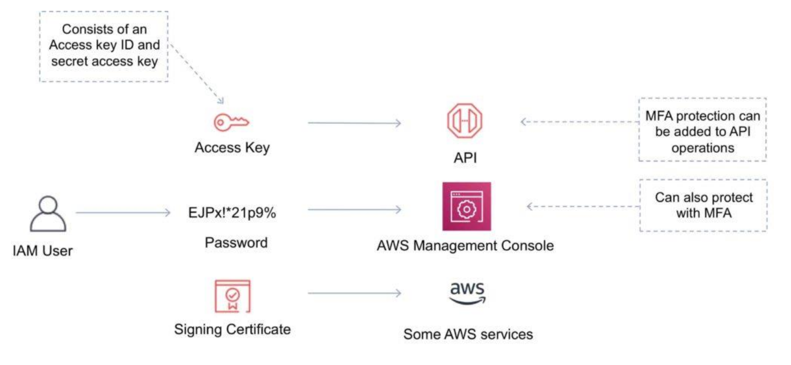</img>

## IAM Best Practices
- Lock away the AWS root user access keys
- Create individual IAM users
- Use AWS defined policies to assign permissions whenever possible
- Use groups to assign permissions to IAM users
- Grant least privilege
- Use access levels to review IAM permissions
- Configure a strong password policy for users
- Enable MFA for privileged users
- Use roles for applications that run on AWS EC2 instances
- Delegate by using roles instead of sharing credentials
- Rotate credentials regularly
- Remove unnecessary credentials
- Use policy conditions for extra security
- Monitor activity in your AWS account


# Section 5: Create AWS Free Tier Account (optional)

## Hands-on AWS online site
- new user : rjzawis
- access key id :  create new ones
- secret access key : 

# Section 6: AWS Compute

- EC2 - web service part of AWS Compute suite of products
- by default, 20 instances per region max
  - if need more, have to apply to AWS & ask - more $$$
- EC2 is a REGIONAL service -must select the region to launch the instance

- created an EC2 instance
- created an EC2 instance w/httpd & default :80/index.html installed

- Amazon Machine Image (AMI)
  - An Amazon Machine Image (AMI) provides the information required to launch an instance
  - An AMI includes the following:
    - One or more EBS snapshots, or, for instance-store-backed AMIs, a template for the root volume of the
      instance (for example, an operating system, an application server, and applications).
    - Launch permissions that control which AWS accounts can use the AMI to launch instances.
    - A block device mapping that specifies the volumes to attach to the instance when it's launched
  - AMIs come in three main categories:
    - Community AMIs - free to use, generally you just select the operating system you want
    - AWS Marketplace AMIs - pay to use, generally come packaged with additional, licensed software
    - My AMIs - AMIs that you create yourself
  - User Data
    - User data is data that is supplied by the user at instance launch in the form of a script
    - User data is limited to 16KB
    - User data and metadata are not encrypted
  - Metadata
    - Instance metadata is data about your instance that you can use to configure or manage the running instance
    - Instance metadata is available at http://169.254.169.254/latest/meta-data
    - The Instance Metadata Query tool allows you to query the instance metadata without having to type out the full URI or category names


- ECS - FARGATE - run Docker containers quickly
  - handles cluster mgmt for you
  - created NGINX cluster
  - Amazon Elastic Container Service (ECS) provides a highly scalable, high performance container management
    service that supports Docker containers
  - A container is similar to a virtual instance, but there’s less to manage
  - With containers the code, runtime, system tools, system libraries and settings are packaged up
  - Containers run quickly and reliably from one computing environment to another
  - Amazon ECS eliminates the need for you to install, operate, and scale your own cluster management
    infrastructure
  - An Amazon ECS launch type determines the type of infrastructure on which your tasks and services are hosted
  - There are two launch types and the table below describes some of the differences between the two launch 
    - types:
      - Amazon EC2 Vs Amazon Fargate
         - EC2 => You explicitly provision EC2 instances 
         - Fargate => The control plane asks for resources and Fargate automatically provisions
         
         - EC2 => You’re responsible for upgrading, patching, care of EC2 pool
         - Fargate => Fargate provisions compute as needed

        - EC2 => You must handle cluster optimization 
        - Fargate => Fargate handles cluster optimization

        - EC2 => More granular control over infrastructure
        - Fargate => Limited control, as infrastructure is automated

- LAMBDA
  - serverless
  - run code w/o provisioning or managing servers
  - "trigger" executed - eg, web page visited
  - don't pay until the code runs
  - AWS Lambda is a serverless computing technology that allows you to run code without provisioning or managing servers
  - AWS Lambda executes code only when needed and scales automatically
  - You pay only for the compute time you consume (you pay nothing when your code is not running)
  - Benefits of AWS Lambda:
    - No servers to manage
    - Continuous scaling
    - Subsecond metering
    - Integrates with almost all other AWS services
  - Use API Gateway Mapping Templates 
    - In API Gateway, an API's method request can take a payload in a different format from the corresponding integration request payload, as required in the backend. Similarly, vice versa is also possible. API Gateway lets you use mapping templates to map the payload from a method request to the corresponding integration request and from an integration response to the corresponding method response. 
    - !Ref={https://docs.aws.amazon.com/apigateway/latest/developerguide/rest-api-data-transformations.html}
    - !Ref={https://docs.aws.amazon.com/apigateway/latest/developerguide/stage-variables.html}
  
  - AWS Serverless Application Model (AWS SAM), SAM supports the following resource types:
    - AWS::Serverless::Api
    - AWS::Serverless::Application
    - AWS::Serverless::Function
    - AWS::Serverless::HttpApi
    - AWS::Serverless::LayerVersion
    - AWS::Serverless::SimpleTable
    - AWS::Serverless::StateMachine
    -!Ref={https://docs.aws.amazon.com/serverless-application-model/latest/developerguide/sam-specification-resources-and-properties.html}
  
  -Lambda function versions !Ref={https://docs.aws.amazon.com/lambda/latest/dg/configuration-versions.html}
    - You can use versions to manage the deployment of your functions. For example, you can publish a new version of a function for beta testing without affecting users of the stable production version. 
    - Lambda creates a new version of your function each time that you publish the function. The new version is a copy of the unpublished version of the function.
    - Note:
      - Lambda doesn't create a new version if the code in the unpublished version is the same as the previous published version. 
      - You need to deploy code changes in $LATEST before you can create a new version.
    
    - Creating function versions
      - You can change the function code and settings only on the unpublished version of a function. 
      - When you publish a version, Lambda locks the code and most of the settings to maintain a consistent experience for users of that version  
      
    - Managing versions with the Lambda API
      - To publish a version of a function, use the PublishVersion API operation.
      ```
      aws lambda publish-version --function-name my-function
      ```
    
      - You should see the following output:
      ```
      {
        "FunctionName": "my-function",
        "FunctionArn": "arn:aws:lambda:us-east-2:123456789012:function:my-function:1",
        "Version": "1",
        "Role": "arn:aws:iam::123456789012:role/lambda-role",
        "Handler": "function.handler",
        "Runtime": "nodejs12.x",
        ...
      }
      ``` 

  - Use API Gateway Lambda authorizers !Ref={https://docs.aws.amazon.com/apigateway/latest/developerguide/apigateway-use-lambda-authorizer.html}
    - There are two types of Lambda authorizers:
        - A token-based Lambda authorizer (also called a TOKEN authorizer) receives the caller's identity in a bearer token, such as a JSON Web Token (JWT) or an OAuth token. For an example application, see Open Banking Brazil - Authorization Samples on GitHub.
        - A request parameter-based Lambda authorizer (also called a REQUEST authorizer) receives the caller's identity in a combination of headers, query string parameters, stageVariables, and $context variables.
        - ### Note 
          - For WebSocket APIs, only request parameter-based authorizers are supported.


- LIGHTSAIL
  - easily provision compute services
  - easily created a WordPress app
  - Amazon LightSail is great for users who do not have deep AWS technical expertise as it make it very easy to
    provision compute services
  - Amazon Lightsail provides developers compute, storage, and networking capacity and capabilities to deploy and
    manage websites, web applications, and databases in the cloud
  - Amazon Lightsail includes everything you need to launch your project quickly – a virtual machine, SSD-based
    storage, data transfer, DNS management, and a static IP
  - Amazon Lightsail provides preconfigured virtual private servers (instances) that include everything required to
    deploy and application or create a database
  - Can create Instances and Databases, and configure Static IP, DNS Zone, Load Balancers, storage, and snapshots


# Section 7: AWS Storage

- Object, Block, and File Storage
- Object - S3
- Block - EBS
- File - File

## S3
- object stored in buckets
- REST API to connect - get, put, post, delete
- referenced via URL

## EBS
- only 1 that can be used as a boot
- appear as local disks
- volumes mounted over a network
- create partitions, etc
- can attach multiple EBS volumes to a single EC2 BUT
  - CANNOT attach the same EBS volume to multiple EC2 instances
- MUST be in same AvlZone
- 1 can be a boot partition, another data

## EFS
- connect using a 'protocol', eg NFS
- mount file system to a mount point

## S3
- upload objects {files, pix, etc} into buckets
- Buckets
    - A bucket is a container for objects stored in Amazon S3. 
    - You can store any number of objects in a bucket and can have up to 100 buckets in your account. 
    - To request an increase, visit the Service Quotas Console.
- Objects
    - Objects are the fundamental entities stored in Amazon S3. 
    - Objects consist of object data and metadata.
    - The metadata is a set of name-value pairs that describe the object. 
    - These pairs include some default metadata, such as the date last modified, and standard HTTP metadata, such as Content-Type. 
    - You can also specify custom metadata at the time that the object is stored.   
    - An object is uniquely identified within a bucket by a key (name)
 - Keys
    - An object key (or key name) is the unique identifier for an object within a bucket. 
    - Every object in a bucket has exactly one key. 
    - The combination of a bucket, object key, and optionally, version ID (if S3 Versioning is enabled for the bucket) uniquely identify each object. 
    - So you can think of Amazon S3 as a basic data map between "bucket + key + version" and the object itself.   
 - S3 Versioning
    - You can use S3 Versioning to keep multiple variants of an object in the same bucket. 
    - With S3 Versioning, you can preserve, retrieve, and restore every version of every object stored in your buckets. 
    - You can easily recover from both unintended user actions and application failures.   


# Section 8: AWS NETWORKING

- VPC - Virtual Private Cloud
- own personal subnets

# Section 9: AWS DATABASES

- relational vs non-relational
- RDS
- DynamiDB
- RedShift
- ElastiCache

# Section 10: AWS Elastic Load Balancing & Auto-Scaling


# Section 11: AWS Content Delivery & DNS Services
- Route 53 - DNS across regions
- CloudFront - ContentDelivery - CDN

# Section 12: AWS Monitoring & Logging SErvices
- CloudWatch : performance
- CloudTrail : auditing

# Section 13: AWS Automation & Platform Services
- CloudFormation {infrastructure}
  - template-driven
  - deploy infrastructure using code
  - services launched for you via JSON
  - Change Sets, Stacks, Templates

- ElasticBeanStalk  {applications} !Ref={https://docs.aws.amazon.com/elasticbeanstalk/latest/dg/Welcome.html}
  - builds containers
  - platform service
  - leverages CloudFormation
  - WAR / ZIP files w/code = environment built "for you"
  - Deploying applications to Elastic Beanstalk environments
    - You can use the AWS Elastic Beanstalk console to upload an updated source bundle and deploy it to your Elastic Beanstalk environment, or redeploy a    previously uploaded version.
    - Elastic Beanstalk provides several deployment policies and settings. For details about configuring a policy and additional settings, see Deployment policies and settings. The following table lists the policies and the kinds of environments that support them.

  - Choosing a deployment policy !Ref={https://docs.aws.amazon.com/elasticbeanstalk/latest/dg/using-features.deploy-existing-version.html}
    
    - <b><i>All at once </b></i> – The quickest deployment method. Suitable if you can accept a short loss of service, and if quick deployments are important to you. With this method, Elastic Beanstalk deploys the new application version to each instance. Then, the web proxy or application server might need to restart. As a result, your application might be unavailable to users (or have low availability) for a short time.

    - <b><i>Rolling </b></i>– Avoids downtime and minimizes reduced availability, at a cost of a longer deployment time. Suitable if you can't accept any period of completely lost service. With this method, your application is deployed to your environment one batch of instances at a time. Most bandwidth is retained throughout the deployment.

    - <b><i>Rolling with additional batch </b></i> – Avoids any reduced availability, at a cost of an even longer deployment time compared to the Rolling method. Suitable if you must maintain the same bandwidth throughout the deployment. With this method, Elastic Beanstalk launches an extra batch of instances, then performs a rolling deployment. Launching the extra batch takes time, and ensures that the same bandwidth is retained throughout the deployment.

    - <b><i>Immutable </b></i>– A slower deployment method, that ensures your new application version is always deployed to new instances, instead of updating existing instances. It also has the additional advantage of a quick and safe rollback in case the deployment fails. With this method, Elastic Beanstalk performs an immutable update to deploy your application. In an immutable update, a second Auto Scaling group is launched in your environment and the new version serves traffic alongside the old version until the new instances pass health checks.

    - <b><i>Traffic splitting </b></i> – A canary testing deployment method. Suitable if you want to test the health of your new application version using a portion of incoming traffic, while keeping the rest of the traffic served by the old application version.

- With Elastic Beanstalk, you can quickly deploy and manage applications in the AWS Cloud without having to learn about the infrastructure that runs those  applications. Elastic Beanstalk reduces management complexity without restricting choice or control. You simply upload your application, and Elastic Beanstalk automatically handles the details of capacity provisioning, load balancing, scaling, and application health monitoring.

- Questions
  - missed What sac can be used to automatically create an Amazon VPC & then launch an EC2 instance.... : Correct answer : CLoudWatch

# Section 14: AWS Migration & Transfer Services

- migrate on-premises to Cloud
- {DMS} Database Migration Service
  - target : Amazon RDS, Aurora

- Snowball, SnowMobile
  - very large amounts of data into AWS

- Questions

# Section 15: AWS Billing & Pricing
- Need to know :
  - what you get for free
    - VPC
    - Elastic Beanstalk {just the resources}
    - CloudFormation  {just the resources}
    - IAM
    - Auto-Scaling
    - Consolidated Billing
    - data going into AWS {only outbound}
  - what you get charged for
    - compute
      - amount of time your instance is running  {based on instance type}
      - load balancing {Network, Balanced}
      - detailed monitoring {CloudWatch}
      - Elastic IP addresses {if allocated but not used}
      - AWS Lambda
      - ECS
      - FarGate
    - storage
      - amount of data being stored
      - S3
        - class type
        - quantity
        - of requests
        - moving data between storage classes
      - S3 Glacier
      - EBS
        - amount provisioned
      - EFS
        - storage classes, amount used
    - network
      - VPN connections
      - PrivateLink
      - NAT Gateways, instances
      - AWS Direct Connect - # port hours
    - Database
      - RDS  {amount of time running}
        - clock time, instance type
    - outbound data transfer
  - how are you charged
    - models
      - on-demand
        - good for short term
      - dedicated
        - good for compliance, licensed software, ie software per workstation
      - spot instances {purchasing spare capacity}
        - up to 90% off on-demand
        - terminated when AWS needs capacity back
      - reservations  {all services will have 'reserved' in their name}
        - good if you predictable usage, @75% savings over on-demand
        - no upfront
        - partial upfront
        - all upfront
      - savings plan
  - special payment options


- Questions

# Section 16: AWS Cloud Security
- Shared Responsibility Model
  - what customer is responsible for
    - Security "IN" the cloud
  - what AWS is responsible for
    - Security "OF" the cloud

- Questions

# Section 17: AWS Architecting for the Cloud
- Best Practices section
- horizontal {increase #instances} over vertical scaling {manually increase instance stats, downtime}
- resources are reusable
- use automation
- loose coupling - reduce interdependencies
  - service discovery
- use existing AWS services - not building new servers
- use right db for workload
- remove single points of failure
  - introduce redundancy
- detect failure {health checks, alarms, automate detection & reaction}
- durable data storage
- optimize for cost
  - only build what you need
- caching
  - improve performance & cost efficiency	
  - Application Data Caching {AWS ElastiCache, Dynamo DB DAX}
- Security
  - use AWS
  - reduce privileged access
  - CloudFormation {build secure environments - template}
  - Auditing - {Trusted Advisor, Config, Inspector}

- 5 Pillars of Operational Excellence
  - Operational Excellence
  - Security
  - Reliability
  - Performance Efficiency
  - Cost Optimization

- Questions

# Section 18: AWS Additional Services Seen on the Exam
- AWS Rekognition - image analysis, objects, facial features, celebrities
  - videos as well
- AWS SNS - Simple Notification Service  {loose coupling} - a push service
  - application integration services
  - publish / subscribe
  - sending notifications from publishers to subscribers
    - eg, EC2, CloudWatch, S3 send a message into SNS topics - sends on to Simple Q Svc, emails, AWS Lambda
    - pushes msgs to subscribers
  - managed service, pay-as-you-go
- AWS SQS Simple Queue Service - pull-based service
  - message bus
  - create queues, msgs get placed into
    - eg, EC2s get info from customers, place info/orders into qs
      - back-end EC2 apps process msgs in qs
  - different types of qs
  - back-end keeps polling qs
- AWS SWF - Simple Workflow Service
  - order service
  - ideal for human-enabled workflows
- AWS Step Functions
  - replacing a lot of SWF use cases
  - uses JSON code
  - creates visual workflow - good for decision tree flows - yes/no, pass/fail - workflows
  - state machines

# Section 19: AWS Full length practice exams
- test # 1 : 80%
- test # 2 : 86%


# Section 20: Extra Labs, multiple EC2 instances w/ELB

# Section 21: Final Exam Preparation + BONUS
- downloaded additional exams and cheat sheet
- checked everything into Git


# Section 22: (SQS) 
- CreateQueue !Ref={https://docs.aws.amazon.com/AWSSimpleQueueService/latest/APIReference/API_CreateQueue.html}
- You can't change the queue type after you create it - You can't change the queue type after you create it and you can't convert an existing standard queue into a FIFO queue. You must either create a new FIFO queue for your application or delete your existing standard queue and recreate it as a FIFO queue.

- The visibility timeout value for the queue is in seconds, which defaults to 30 seconds - The visibility timeout for the queue is in seconds. Valid values are: An integer from 0 to 43,200 (12 hours), the Default value is 30


# Sectin 23: (Contêineres:)
## Amazon Elastic Container Registry (ECR)
- Is a fully-managed Docker container registry that makes it easy for developers to store, manage, and deploy Docker container images. 
- Amazon ECR is integrated with Amazon Elastic Container Service (ECS), simplifying your development to production workflow.
- !Ref={https://aws.amazon.com/ecr/}

## ECS - Amazon Elastic Container Service (Amazon ECS)
- Is a highly scalable, fast, container management service that makes it easy to run, stop, and manage Docker containers on a cluster. 
- You can host your cluster on a serverless infrastructure that is managed by Amazon ECS by launching your services or tasks using the Fargate launch type. 
- For more control over your infrastructure, you can host your tasks on a cluster of Amazon Elastic Compute Cloud (Amazon EC2) instances that you manage by using the EC2 launch type.
- You cannot use ECS to store and deploy Docker images.
- !Ref={https://docs.aws.amazon.com/AmazonECS/latest/developerguide/Welcome.html}


# Others 
- trade capital expense for variable/operational expense
- benefit from massive economies of scale
- stop guessing capacity
- increase speed & agility
- stop spending $$ running & maintaining data centers
- go global in minutes

# AWS Global Infrastructure
- 24 Regions
- 76 Availability Zones
- 205+ Edge Locations

- US East 1 - 1st region made generally available
  - 50 mile radius around there - AZ

- infrastructure.aws - website showing global AWS infrastructure


# Regions & AZs
- Regions - separate independent areas
- AZs connected by high-speed low-latency links

# AZs
- multiple isolated locations within a region
- 1 AZ @= 1 data center
- independent failure zones
- physically separated
- on separate Low Risk Flood Plains

# 4 Popular Use cases
- Dev & Test
  - eg, Elastic BeanStalk {no charge for service - service for the resources}
    - easily create copies of their environments
    - upload code - BeanStalk does resource allocation
  - resources only needed when used

- Storage
  - low cost data storage
  - object, block & file storage
  - S3 {11 9's security, Glacier {low-cost archival}

- Disaster Recovery
  - enables faster disaster recovery of they critical IT systems w/o
    incurring infrastructure expense for a 2nd site
  - Fast Performance
  - No Tapes
  - Compliance
  - Elasticity
    - add any amount of data quickly adapting to increase / decrease resources
  - Secure
    - Auditing, Certifications, etc
  - Partners
    - Solution Provider & Integration Assistance

- Big Data
  - Storage & Databases
    - Object Storage
    - NoSQL
    - Graph databases
    - HBase
    - Aurora
  - Analytic Frameworks
    - Hadoop & Spark
    - ElasticSearch
  - Data Warehousing
    - RedShift
  - Business Intelligence
  - Real-Time Analytics
  - Machine Learning

- AWS Storage Gateway - connect on-premises db to cloud-based AWS services


# Shared Responsibility Model
- who is responsible for what
- Security & Compliance -> shared responsibility
- AWS - security "OF" the cloud
  - hardware, data centers, networking equipment & software
- Customer - security "IN" the cloud 
  - all application security
  - data encryption
  - OS security patches, IAM, network & firewall configurations


# AWS Well-Architected Framework
- Pillars
- Design Principles
- Questions

# 5 Pillars
- Operations Excellence
- Security
  - implement a strong identity foundation
  - enable traceability
  - apply security at all layers
  - automate best practices
  - encrypt data in transit & at rest
- Reliability
  - test recovery procedures
  - automatically recover
  - scale horizontally to increase aggregate system availability
  - stop guessing capacity
  - manage change using automation
- Performance
  - use advanced technologies
  - go global in minutes
  - use server less architectures
    - DynamoDB
    - Lambda
  - experiment more often
  - mechanical sympathy
- Cost Optimization
  - adopt a consumption model
  - measure overall efficiency
  - stop spending money on datacenter operations
  - analyze and attribute expenditure
  - use managed services to reduce cost of ownership


# AWS Compute Services
- EC2
  - Elastic Compute Cloud
  - resizable compute capacity
  - instance types
    - combines CPU, memory, storage & networking capacity
    - c4.large
      - 'c' : Instance Families, 'c' -> compute
      - '4' : Instance Generations
      - 'large' : Instance sizes

  - integrated with
    - EBS
    - CloudWatch
    - VPC
    - IAM
    - Batch
    - ECS - container service

  - Instance Types
    - On-Demand
      - pay only when used
    - Reserved Instances
      - discounted price, up to 75% - NEED to make a time commitment, eg 1 - 3 years
      - !Ref={https://docs.aws.amazon.com/AWSEC2/latest/UserGuide/reserved-instances-types.html}
      - !Ref={https://aws.amazon.com/ec2/pricing/?nc1=h_ls}
      - !Ref={https://docs.aws.amazon.com/AWSEC2/latest/UserGuide/instance-purchasing-options.html}
      - !Ref={https://docs.aws.amazon.com/AWSEC2/latest/UserGuide/reserved-instances-types.html}
    - Spot
      - discounted - uses "spare"/unused compute capacity
      - up to 90% 
      - good for no time commitment serverless applications, big data calls
      - auction / bid to obtain - can go away at any time {2 minute notice}
  - Burstable performance instances
    - !Ref={https://docs.aws.amazon.com/AWSEC2/latest/UserGuide/burstable-performance-instances.html}


# Data Storage Options
- Instance Store
  - temporary - once instance stops - data goes away
  - physically attached to host
  - good for cache, scratch data
- EBS
  - persistent
  - data is independent of instance lifecycle


# AMIs
- Composed of AMI - Machine Images
  - Amazon maintained
  - Community Built
  - Personally built ones  {can be public or private}


# Auto-Scaling
- Maintains EC2 Instance availability
  - detects bad ones
  - replaces w/good
- Automatically Scale Up / Down
  - based on cfg'd settings / rules

# AWS Lambda
- serverless Compute service  {DynamoDB - RDS}
- runs code in response to events 
  - automatically manages underlying resources

# AWS Storage Services
- S3 - Simple Storage Service
- can run AWS Analytic Services against S3
  - Athena, Redshift, EMR
- S3 Lake
  - stand up a Data Lake
- up to 10 object tags
  - use tags to perform operations
- can assign access policies against data
- ACLs - access control list
- 6 Classes - cost-based
- Glacier & Glacier Deep Archive
  - longer term storage
- can analyze data and move data between classes
- manage data at all levels at-scale
- cfg fine-tune access to data
- cost effectively store data across classes
- audit & report on data
  - develop rules against analysis
- 11 9s of durability
- scale data on-demand & in minutes
- ingest & store as much data as needed, eg good for Big Data

# Classes
- Standard
  - multi AZ
  - used for frequent access
- Intelligent-Tiering
  - uses deep learning to analyze
  - data w/changing access patterns
  - optimize storage costs
  - no management required  {cost optimized automatically}
  - no retrieval fees
  - supports all of the capabilities of the rest of the S3 storage classes
- Standard 1A - '1A' - Infrequent Access
- One Zone 1A {only 1 AZ}
  - infrequent access
  - multi AZ
  - easily recreatable data
  - mobile / enterprise backup data
- Glacier
- Glacier Deep Archive
  - cold storage
  - accessed infrequently
  - fee for retrieving
  - good for media archives, medical data
  - recover in 12 hours or less
  - fully managed


## EBS - Elastic Block Storage
- durable high-performance
- simple to use
  - low latency, high throughput
- performant
  - elastic volumes
    - adjust size & tune performance w/NO disruption
- reliable
  - scaled across multi AZ
- snapshots 
  - incremental
  - users control encryption
- each EC2 has 1 EBS Boot Volume


## EFS - Elastic File System
- NFS file System
- SIMple
  - fully managed
  - can mount multiple
  - secure
- elastic
  - grows automatically
  - stores data redundantly by default
- scalable


## Data Transfer
- Direct Connect
  - private connection between on-premises & AWS
  - establish a quick on-premises to AWS connection
  - 1 GB, 10 GB
- SnowBall, Snowmobile
  - send data in bulk, ie Tera, Peta, Exa
  - data encrypted
  - hardware devices sent to you
- Storage Gateway
  - hybrid cloud data storage solution
  - simplify storage mgmt
  - 3 Types
    - simple 
    - Tape / File / ????
  - connects to other S3 storage services
- Transfer Acceleration
- Kinesis
- many others


## IAM : Security & Access Control
- IAM - identity & Access Management
- users, groups
  - Permissions assigned to Policies
  - Policies assign to Roles
  - Roles given to users, groups
- USERS
  - entity that interact w/AWS
  - person or service
  - access thru AWS Console {userid, password} / or CLI {Access Key & ID}
- eg, new employee
- use root user as little as possible
- best practice
  - use root user to create an IAM user w/Admin access

## Users & Permissions
- no permissions by default when created
- have to attach permissions
  - ie, who has access
  - what actions

## Policies
- Managed
  - attached to multiple users, groups and roles
- Inline
  - usually just for one-off causes

## Groups
- reduces individual user management
- assign policy to a Group - then add users into groups

## Roles
- an identity w/permission policies that determine what the identity can / cannot do
- can be assumed by anyone
- give cross-account access
- access within an account
- NO credentials
- Federation : give access to identities defined outside AWS


## VPC
- default one every region
- can span Availability Zones
- own logically isolated area w/in a region
- ENI - elastic network interface
  - represents a virtual network card
- Subnet  {firewall for your EC2}
  - public
  - private
    - no route to an Internet gateway
- Internet Gateway
  - attached to VPC - allows access out to Internet
  - provides a target in your VPC route tables for internet
  - perform network access translation {NAT}
- NACL
  - firewall
- Route Table
  - directs where traffic from your VPC goes


## VPC Peering
- networking connection between 2 VPCs
- enables you to route traffic between them using private IP addresses
- appear to be communicating as if in the same network 
- allows inter-region connections
- helps facilitate the transfer of data
  - eg, create a file-sharing network


##  AWS Database Services
- relational
  - Aurora, RDS
- key-value
  - DynamoDB
- In-memory
  - ElastiCache
- Document
  - DocumentDB

## Aurora {RDS}
- MySQL, PostgreSQL compatible relational
- performance & scalable
- availability & durable
- highly secure
- fully managed by RDS
- 5 times faster MySQL / 3 times faster PostgreSQL
- read-replicas
- cost effectiveness - 1/10 the cost


## RDS
- Aurora, MySQL, PostgreSQL, MariaDB, SQL Server, Oracle
- managed relational
- easy to administer
- highly scalable
- fast & secure
- available & durable
  - automatic multi-AZ
- DMS
  - Database Migration Service
    - migrates on-premises source dbs to AWS
  - source db remains fully operational

## DynamoDB
- NoSQL db service
- performance
- fully managed
  - scales up & down automatically
- serverless
  - good for modern apps
- comprehensive security
- global database for global users and apps
- encrypts all data by default
- integrates w/ IAM
- easily replicates tables across multiple AWS Regions


## DocumentDB
- mongodb-compatible
- fully managed, scalable
- performance at scale
- durable
  - 6 copies of data across 3 AZs
- highly available
- can be used w/AWS DMS


## RedShift  {large data sets, analysis}
- data warehouse service
- fast
  - paralel processing
- highly scalable
- virtually unlimited concurrency
  - dynamically scales based on data volumes
- extends your data lake
- 10x performance
- 1/10th cost
- uses machine learning to analyze data - peta, exabytes
- use KMS & HSM for security


##  Monitoring & Auditing
- CloudWatch  {resource monitoring}
  - monitoring service
  - monitors cloud resources, applications
  - collects & tracks metrics
  - collect & monitor log files
  - set alarms
    - based upon analysis
    - high resolution
    - help w/cost
  - Logs
    - collect & store
    - Bended  {AWS logs}
    - AWS Service Logs
    - Custom {apps, on-premises}
      - install agent to collect on-premises logs
  - built-in Dashboards to display metrics
  - graph metrics & data for analysis
  - eg, CPU utilization, memory

- CloudTrail  {AUDITing user account actions, activity, console,}
  - enabled by default
  - compliance auditing 
  - operational troubleshooting
  - security analysis
  - automatic compliance remediation
  - actions taken by users, roles or AWS service are recorded
  - last 90 days kept around
  - Event History
  - Management Events - management operations
  - Data Events - resource operations performed


## AWS CloudFormation  {SaaS}
- InfraStructure As Code
- Templated resource provisioning
- create templates to describe the AWS Resources used to run your application
- no charge for service
  - charged for resource usage
- infrastructure as code
  - entire architecture described in a text file
  - Designer - usually design your architecture - saves to a text file
- automates provisioning of architecture
- intrinsic Functions
- !ref ={https://docs.aws.amazon.com/AWSCloudFormation/latest/UserGuide/intrinsic-function-reference.html}

- ### Outputs CloudFormation
  - Syntax !Ref= {https://docs.aws.amazon.com/AWSCloudFormation/latest/UserGuide/outputs-section-structure.html}
    - The Outputs section consists of the key name Outputs, followed by a space and a single colon. You can declare a maximum of 200 outputs in a template.
    - The following example demonstrates the structure of the Outputs section.
  - Note
    - The following restrictions apply to cross-stack references:
    - For each AWS account, Export names must be unique within a region.
    - You can't create cross-stack references across regions. You can use the intrinsic function Fn::ImportValue to import only values that have been exported within the same region.
    - For outputs, the value of the Name property of an Export can't use Ref or GetAtt functions that depend on a resource.
      Similarly, the ImportValue function can't include Ref or GetAtt functions that depend on a resource.
    - You can't delete a stack if another stack references one of its outputs.
    - You can't modify or remove an output value that is referenced by another stack.

  


## AWS CloudFront  {Content Delivery Service}
- delivers content to customers
- global content delivery
- works w/WAF & Shield - protects DDoS


## Edge Locations  {CDN}
- used w/CloudFront
- "instances" that contain user data close to end users

## Route 53
- DNS Web Service
- route end users to Internet applications by using a human readable URL
- ### Choosing a routing policy 
  - !Ref={https://docs.aws.amazon.com/Route53/latest/DeveloperGuide/routing-policy.html}
  - When you create a record, you choose a routing policy, which determines how Amazon Route 53 responds to queries:
      - <b><i>Simple routing policy </i></b> – Use for a single resource that performs a given function for your domain, for example, a web server that serves content for the example.com website.
      - <b><i>Failover routing policy </i></b>– Use when you want to configure active-passive failover.
      - <b><i>Geolocation routing policy </i></b>– Use when you want to route traffic based on the location of your users.
      - <b><i>Geoproximity routing policy </i></b>– Use when you want to route traffic based on the location of your resources and, optionally, shift traffic from resources in one location to resources in another.
      - <b><i>Latency routing policy </i></b>– Use when you have resources in multiple AWS Regions and you want to route traffic to the Region that provides the best latency with less round-trip time.
      - <b><i>Multivalue answer routing policy </i></b> – Use when you want Route 53 to respond to DNS queries with up to eight healthy records selected at random.
      - <b><i>Weighted routing policy </i></b> – Use to route traffic to multiple resources in proportions that you specify.


## AWS Config   {Compliance}
- monitors configuration and changes between cfgs
- simplify security configuration, management, troubleshooting
- fully managed
- inventory
- history
- change notifications
- discover existing resources
- assess overall compliance & risk status
- SNS - get notified via AWS Simple Notification Service of changes


## Artifact
- central resource for compliance documentation
- certifications, regulations, attestations, etc

## Cost Optimization----
- on-demand
  - spiky demands
- reserved
  - for a known committed time period
- spot
  - time insensitive, goes away at any time
  - spare
- dedicated
  - highly sensitive
  - most expensive
  - dedicated resources
  - cause your own licenses


## Support Plans
-------------
- Basic
  - long response times
  - not much support
- Developer
- Business
  -most popular
  - 24x7 access
- Enterprise
  - dedicated TAM - Tech Account Manager


## AWS Organizations
- centrally govern your environment
- policy based management for multiple AWS accounts
- control AWS service use across accounts
- automate account creation
- consolidate billing & Usage reporting
- manage cross-account access


## Service Control Policy - SCP
- control which AWS service actions are accessible to account principals - including root


## Practice tests
- WhizLabs - free practice tests


Duvidas?
What are the advantages of Reserved Instances? (Choose two.)

Which tool can be used to compare the costs of running a web application in a traditional hosting environmentto running it on AWS?

What is AWS Trusted Advisor?

Which AWS service can be used to query stored datasets directly from Amazon S3 using standard SQL?

What is the purpose of AWS Storage Gateway?